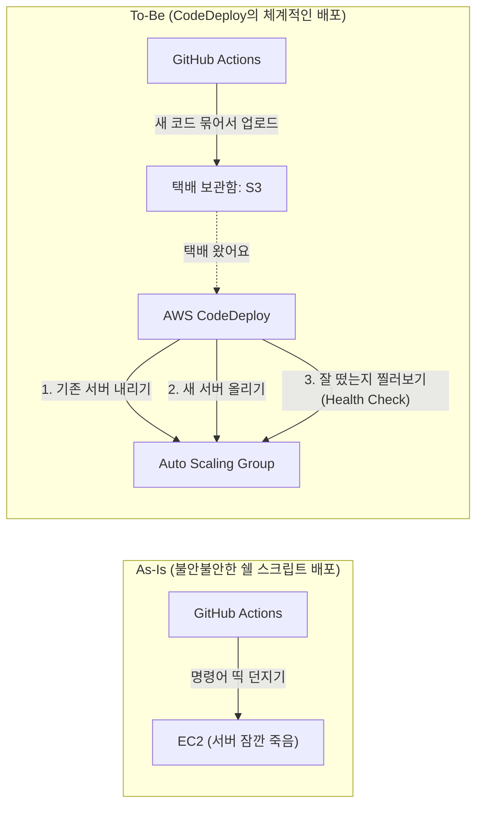
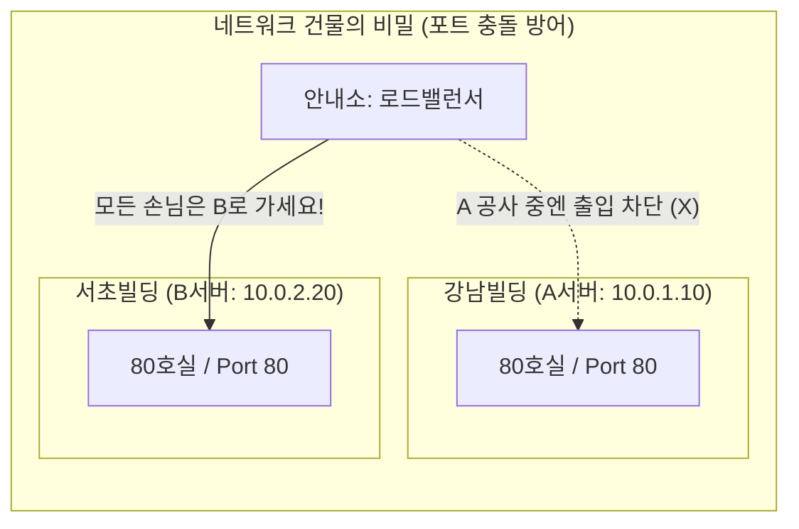

## 1. Executive Summary (10초 요약)
* **도입 배경**: 지금까지는 업데이트를 할 때마다 깃허브 액션이 서버(EC2)에 직접 접속해서 스크립트를 실행하는 수동적인 방식으로 배포했습니다.
* **핵심 문제**: 배포하다가 에러가 나면 롤백이 안 돼서 서버가 멈춰버렸고, 배포가 잘 됐는지 일일이 로그를 뒤져봐야 하는 고통이 있었습니다.
* **해결 방안**: 큰맘 먹고 AWS의 배포 전문 서비스인 **CodeDeploy**를 도입했습니다. `appspec.yml`과 쉘 스크립트들을 작성해서 체계적인 **In-Place(롤링) 배포** 환경을 만들었습니다.
* **성장 포인트**: 이제 AWS 콘솔에서 배포가 성공했는지 눈으로 쫙 볼 수 있게 되었고, 배포 실패 시 예전 버전으로 자동 롤백되는 안정적인 봇(Bot)을 얻게 되었습니다!

---

## 2. Architecture Evolution (진화 과정)

---

## 3. Deep Dive (트러블슈팅 서사)

### 🔥 Issue: 테라폼이 자꾸 "모른다"고 배째는 순환 참조 에러
테라폼으로 CodeDeploy를 만들려는데 자꾸 에러(`ApplicationAlreadyExistsException`)가 났습니다. 처음엔 원인을 파악하지 못해 **몇 시간 동안 트러블슈팅을 진행했습니다.** 알고 보니, CodeDeploy는 배포할 대상인 **ASG(Auto Scaling Group)**가 먼저 만들어져 있어야만 생성이 가능합니다. 그런데 제가 CodeDeploy 코드를 ASG가 없는 `EC2` 모듈 안에 넣어버렸더니, 테라폼이 "난 ASG가 누군지 몰라!" 하고 뻗어버린 것이었습니다.

**💡 깨달음 및 해결책**: CodeDeploy는 단순한 서버(EC2)가 아니라 '트래픽과 배포를 관리하는 녀석'이었습니다. 과감하게 CodeDeploy 코드를 ASG와 묶여있는 `LoadBalancer` 모듈 쪽으로 이사시켜 주었더니 에러가 깔끔하게 해결되었습니다! 

---

## 4. 💡 특별 부록: 초등학생도 이해하는 롤링 배포와 포트의 비밀

데브옵스를 공부하며 가장 헷갈렸던 두 가지 개념을 '식당과 건물' 비유로 완벽하게 정리해 보았습니다.

### ① 무중단 롤링 배포의 원리 (식당 공사 비유)
왜 화려한 **블루/그린(Blue/Green)** 배포 대신 **롤링(Rolling / In-Place)** 배포를 썼을까요?

* **블루/그린 (새 건물 짓기)**: 장사 중인 식당(Blue) 옆에 똑같은 크기의 새 식당(Green)을 짓고 인테리어를 마친 뒤, 손님들을 1초 만에 새 식당으로 안내하는 방식입니다. 다운타임은 0초지만, **서버(식당)를 2배로 유지해야 해서 인프라 요금이 2배로 폭증**합니다.
* **롤링 (테이블 돌아가며 공사하기)**: 새 건물을 살 돈이 없으니, **1번 테이블만 펜스를 치고(손님 차단) 교체 ➡️ 끝나면 2번 테이블 교체** 하는 방식입니다. 추가 서버 비용이 0원이라는 엄청난 장점이 있습니다. 대신 교체하는 동안에는 남은 테이블들이 밀려드는 손님을 다 받아야 해서 부하가 생깁니다.
* **나의 결정**: 현재 실습 환경에서는 요금을 아끼는 것이 최우선이므로, 가성비 끝판왕인 **롤링 배포**를 선택했습니다!

### ② 같은 80포트인데 어떻게 충돌이 안 날까? (건물과 호실 비유)

롤링 배포를 하려면 서버가 최소 2대 이상 돌아가야 합니다. 여기서 큰 의문이 생겼습니다. *"어? 서버 2대가 전부 80포트를 쓰면 서로 충돌하는 거 아니야?"*

네트워크의 대원칙을 '건물'로 비유하면 의문이 풀립니다.
* **IP 주소 (컴퓨터)** = 건물의 **도로명 주소**
* **Port (포트)** = 그 건물 안의 **호실(가게) 번호**

A 서버(강남빌딩 80호실)와 B 서버(서초빌딩 80호실)는 **아예 물리적인 주소(IP)가 다릅니다.** 따라서 똑같은 80포트를 열고 장사해도 절대 충돌하지 않습니다. 
이때 도로 한가운데 서 있는 **안내소(로드밸런서)**가 손님을 강남빌딩이나 서초빌딩으로 골고루 나눠줍니다. 만약 A서버가 배포(공사)에 들어가면 위 그림처럼 로드밸런서가 센스 있게 모든 손님을 B서버 80호실로만 보내주기 때문에 완벽한 무중단 배포가 성립하는 것입니다!

---

## 5. STAR-F Q&A (셀프 방어)

**Q. 컨테이너(Docker)를 쓰시는데 굳이 CodeDeploy까지 쓰신 이유가 있나요? 그냥 GitHub Actions에서 SSH로 docker-compose down/up만 해도 될 텐데요.**
> A. 맞습니다. 처음엔 저도 그렇게 썼습니다! 하지만 SSH로 스크립만 실행하게 되면, 서버가 만약 에러가 나서 안 켜졌을 때 **자동으로 예전 버전으로 돌리는 기능(롤백)**을 구현하기가 너무 힘들었습니다. CodeDeploy를 도입하니 스크립트가 실패했을 때 알아서 예전 상태로 롤백을 해주어서 서비스 안정성이 훨씬 높아졌습니다.

**Q. 테라폼 쓰면서 가장 힘들었던 점이 무엇인가요?**
> A. 제가 짠 순서대로 테라폼이 만들어주지 않을 때 제일 힘들었습니다. 방금 말씀드린 순환 참조 에러처럼, 인프라는 무작정 짜는 게 아니라, 의존성의 흐름(누가 먼저 태어나야 하는가)을 아키텍처적으로 고민해야 한다는 걸 배운 좋은 삽질이었습니다!
