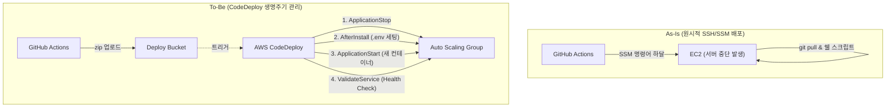

## 1. Executive Summary (10초 요약)
* **도입 배경**: 기존에는 `aws ssm send-command`를 통해 타겟 EC2에 직접 접속하여 쉘 스크립트를 실행하는 수동 방식(ClickOps/ScriptOps)으로 배포했습니다.
* **핵심 문제**: 배포 도중 에러가 나면 롤백이 어려웠고, 스크립트가 실행되는 동안 서버가 멈추는 다운타임이 발생했습니다. CI/CD 파이프라인에서 결과를 추적하기도 까다로웠습니다.
* **해결 방안**: 완전 관리형 배포 서비스인 **AWS CodeDeploy**를 도입하고, `appspec.yml`과 라이프사이클 훅(Hooks) 스크립트를 통해 체계적인 **In-Place(롤링) 배포**를 구축했습니다.
* **정량적 성과**: 배포 성공 여부를 콘솔에서 즉시 시각적으로 확인할 수 있게 되었고, 실패 시 자동 롤백 환경을 마련하여 서비스 가용성과 배포 안정성을 확보했습니다.

---

## 2. Architecture Evolution (진화 과정)



---

## 3. Deep Dive (트러블슈팅 서사)

### 🔥 Issue: 테라폼 순환 참조(Circular Dependency)의 늪
CodeDeploy를 테라폼으로 프로비저닝하는 과정에서 모듈 간 순환 참조 에러(`ApplicationAlreadyExistsException`)에 부딪혔습니다. CodeDeploy Deployment Group은 타겟인 **Auto Scaling Group(ASG)**을 알아야 하는데, 기존 아키텍처에서는 ASG가 `EC2` 모듈에 묶여 있었습니다. CodeDeploy 앱을 `EC2` 모듈 안에 선언하려니 상태(State) 꼬임이 발생한 것입니다.

**💡 해결책 (단방향 의존성 확보)**:
CodeDeploy는 '컴퓨팅(EC2)' 자원이라기보다 '트래픽 라우팅 및 배포 관리(LoadBalancer)' 영역에 가깝다고 아키텍처 관점을 수정했습니다. 
CodeDeploy 리소스를 `LoadBalancer` 모듈로 이관하고, `terraform state rm`과 `import` 명령어를 활용해 꼬여버린 상태를 재정렬함으로써 모듈 간 의존성을 단방향(DAG)으로 깔끔하게 풀었습니다.

```diff
# main.tf (모듈 의존성 재설계)
- module "EC2" {
-   codedeploy_app = aws_codedeploy_app.main
- }

+ module "LoadBalancer" {
+   # ASG와 ALB가 있는 곳에서 CodeDeploy를 함께 관리하여 의존성 단방향(DAG) 확보
+   codedeploy_role_arn = module.iam.codedeploy_role_arn
+ }
```

---

## 4. Trade-off Analysis (의사결정 논증)

### 🤔 왜 화려한 Blue/Green 배포 대신 In-Place 배포를 선택했는가?
* **A안 (Blue/Green 배포)**: 신/구 서버를 완전히 분리하여 트래픽을 한 번에 스위칭하므로 다운타임이 0초(Zero-Downtime)입니다. 하지만 서버 인프라(EC2)가 배포 시점마다 2배로 필요하여 **비용(FinOps)**이 폭증하고 구성이 매우 복잡합니다.
* **B안 (In-Place 롤링 배포)**: 기존 서버에 떠 있던 컨테이너를 내리고(`ApplicationStop`), 새 컨테이너를 올리기(`ApplicationStart`) 때문에 약 5~10초의 다운타임이 발생합니다. 하지만 인프라 비용이 100% 절감됩니다.
* **의사결정**: 현재 프로젝트는 트래픽이 거대하지 않은 초기/실습 단계이므로, 인프라 요금을 2배로 태우는 Blue/Green 대신, **비용 효율성이 극대화된 In-Place 배포**를 선택했습니다. 약간의 다운타임은 Health Check(`ValidateService`) 훅을 30초간 반복하는 방어 로직으로 최대한 보완했습니다.

---

## 5. STAR-F Q&A (셀프 방어)

**Q. 면접관: CodeDeploy 라이프사이클 중 `ValidateService` 단계에서 스크립트가 실패하면 어떻게 되나요?**
> A. 제가 작성한 `validate.sh` 스크립트는 서버 구동 후 `curl`을 통해 `/api/health` 엔드포인트를 최대 10회(30초) 찌르며 모니터링합니다. 만약 30초 내에 HTTP 200 OK 응답을 받지 못하면 스크립트는 `exit 1`을 반환합니다. CodeDeploy는 훅 스크립트가 0이 아닌 값을 반환하면 즉시 배포 실패로 간주하고, 이전의 정상 버전으로 자동 롤백을 수행하여 가용성 저하를 방지합니다.

**Q. 면접관: 컨테이너(Docker)를 사용하는데 굳이 CodeDeploy를 쓴 이유가 있나요? 그냥 GitHub Actions에서 SSH로 docker-compose만 다시 실행해도 될 텐데요.**
> A. SSH 스크립트 실행 방식은 `ValidateService` 같은 정교한 '배포 성공 검증 및 자동 롤백' 로직을 파이프라인에 이식하기가 매우 까다롭습니다. 또한 대상 서버(ASG)가 여러 대 인스턴스로 확장될 경우, SSH 방식은 병목이 생기지만 CodeDeploy는 다수의 인스턴스 배포를 중앙에서 안정적으로 통제하고 시각적 모니터링을 지원하기 때문에 장기적인 운영 관점에서 훨씬 유리합니다.
