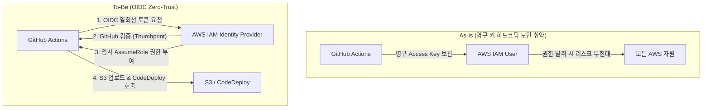

## 1. Executive Summary (10초 요약)
* **도입 배경**: CodeDeploy 배포 환경을 완성했으나, 주방장(GitHub Actions)이 AWS 우편함(S3)과 배달원(CodeDeploy)을 조종하려면 막강한 권한의 AWS Access Key가 필요했습니다.
* **핵심 문제**: GitHub Repository Secrets에 영구적인 Access Key를 하드코딩하는 방식은, 키가 유출될 경우 인프라 전체가 장악당하는 심각한 보안 리스크를 안고 있었습니다. 또한, 비용 절감을 위해 잦은 인프라 삭제(`terraform destroy`)를 진행할 때 AWS 자동 생성 리소스(유령 껍데기)로 인해 삭제가 멈추는(Hang) 현상이 있었습니다.
* **해결 방안**: 
  1. Access Key를 전면 폐기하고, 일회성 인증 토큰을 주고받는 **Zero-Trust 기반의 OIDC(OpenID Connect)** 아키텍처를 도입했습니다.
  2. VPC 파괴 전 AWS CLI를 쏴서 찌꺼기(유령 랜선과 껍데기)를 선제 타격하는 자동 청소 파이프라인을 구축했습니다.
* **정량적 성과**: 하드코딩된 자격 증명을 0개로 줄여 보안을 극대화했으며, CI/CD 자동화 성공률을 100%로 끌어올림과 동시에 잦은 인프라 철거 시 소요되던 수동 개입 시간(ClickOps)을 완전히 없앴습니다.

---

## 2. Architecture Evolution (진화 과정)



---

## 3. Deep Dive (트러블슈팅 서사)

### 🔥 Issue 1: GitHub 배포 시 AWS 자격 증명 보안 리스크
기존 방식은 누군가 GitHub 관리자 권한을 얻으면 AWS의 모든 권한을 영구적으로 탈취할 수 있었습니다. 이를 해결하기 위해 테라폼에 OIDC Provider를 연동하고, **'오직 내 레포지토리(duwnstj/cover-challenge)'에서만 임시 권한을 발급**받을 수 있도록 엄격한 조건을 걸었습니다.

```diff
# .github/workflows/deploy.yml (OIDC 연동 적용)
- name: Configure AWS Credentials
  uses: aws-actions/configure-aws-credentials@v4
  with:
-   aws-access-key-id: ${{ secrets.AWS_ACCESS_KEY_ID }}
-   aws-secret-access-key: ${{ secrets.AWS_SECRET_ACCESS_KEY }}
+   role-to-assume: ${{ secrets.AWS_OIDC_ROLE_ARN }}
    aws-region: ap-northeast-2
```

### 🔥 Issue 2: Terraform Destroy 무한 대기 (유령의 껍데기)
FinOps를 위해 인프라를 삭제(`destroy`)할 때마다 5분 이상 무한 대기(Hang)에 빠졌습니다. 
추적해보니, 이전에 잡았던 'GuardDuty 유령 랜선(ENI)' 자체는 삭제되었으나, AWS가 그 랜선을 위해 자동으로 씌워준 **관리형 보안 그룹(SG)** 껍데기가 VPC 내부에 덩그러니 남아 테라폼의 발목을 잡고 있었습니다.

```diff
# terraform/modules/vpc/main.tf (청소 로봇 스크립트 진화)
  $endpointIds = (aws ec2 describe-vpc-endpoints ...)
  aws ec2 delete-vpc-endpoints --vpc-endpoint-ids $idsArray

+ Write-Host "🕵️ GuardDuty 잔여 껍데기(보안 그룹)를 수색합니다..."
+ $sgIds = (aws ec2 describe-security-groups --filters "Name=vpc-id,Values=${self.triggers.vpc_id}" "Name=group-name,Values=GuardDutyManagedSecurityGroup*" --query "SecurityGroups[*].GroupId" --output text)
+ 
+ if (-not [string]::IsNullOrWhiteSpace($sgIds)) {
+     foreach ($sg in $sgIds -split '\s+') {
+         aws ec2 delete-security-group --group-id $sg
+     }
+ }
```

---

## 4. Trade-off Analysis (의사결정 논증)

### 🤔 왜 IAM User(Access Key) 대신 설정이 복잡한 OIDC를 선택했는가?
* **A안 (IAM User)**: 설정이 빠르고 직관적이나, Access Key 유출 시 회사가 파산할 수준의 해킹(비트코인 채굴 등)을 당할 수 있습니다.
* **B안 (OIDC)**: 테라폼으로 Identity Provider를 만들고 Trust Policy를 정교하게 짜야 하는 수고로움이 있습니다. 하지만 **1회성 토큰** 방식이므로 키가 유출될 물리적 가능성 자체가 없습니다.
* **의사결정**: 금융/핀테크 업계에서 강제하는 **Zero-Trust 아키텍처**를 실무 수준으로 경험하기 위해, 초기 구축 비용(시간)을 지불하더라도 완벽한 보안을 자랑하는 B안(OIDC)을 채택했습니다.

### 🤔 S3 버킷을 하나로 쓰지 않고 왜 Terraform State와 Deploy 용도를 분리했는가?
Terraform State 버킷은 인프라 전체의 매핑 정보를 담고 있는 '1급 기밀 호적 장부'입니다. 반면 Deploy 버킷은 빌드된 `.zip` 파일이 오가는 '동네 택배 보관함'입니다. 만약 개발자가 배포 찌꺼기를 정리하려다 실수로 State 파일까지 지우면 인프라 전체가 붕괴되므로, 용도별 망 분리 원칙에 따라 S3를 철저히 격리했습니다.

---

## 5. STAR-F Q&A (셀프 방어)

**Q. 면접관: OIDC를 도입하셨는데, 본인의 깃허브 레포지토리가 아닌 다른 누군가의 레포지토리에서 임의로 OIDC 요청을 보내어 Role을 탈취할 위험은 없나요?**
> A. 그 위험을 방어하기 위해 테라폼 `aws_iam_role`의 `assume_role_policy` 내부에 엄격한 `Condition` 블록을 작성했습니다. `StringLike` 연산자를 사용하여 `token.actions.githubusercontent.com:sub` 값이 정확히 `repo:duwnstj/cover-challenge:*` 인 경우에만 토큰을 발급하도록 AWS IAM 단에서 원천 차단해 두었기 때문에 안전합니다.

**Q. 면접관: 테라폼으로 AWS 인프라를 삭제할 때 무한 대기에 빠지는 현상(Hang)의 근본적인 원인과 SRE 관점에서의 해결책은 무엇인가요?**
> A. 근본 원인은 테라폼의 상태 파일(State)에 기록되지 않은 Out-of-band 리소스(AWS가 자동으로 생성한 GuardDuty ENI 및 SG)가 존재하기 때문입니다. 테라폼은 자기가 모르는 리소스가 VPC 안에 남아있으면 VPC 삭제를 거부합니다. SRE 관점에서 이를 수동(ClickOps)으로 지우는 것은 안티패턴이므로, `null_resource`와 `local-exec`를 활용하여 파괴(destroy) 시퀀스 직전에 강제 청소 스크립트가 실행되는 자동화 파이프라인을 구축하여 해결했습니다.
