> [!NOTE]
> 이 글은 인프라 구축부터 CI/CD 배포까지 이어지는 SRE 트러블슈팅 대서사시의 첫 번째 파트입니다.
> 1. **[1/4] Terraform 파괴의 나비효과: 상태 불일치(Drift)와 소크라테스 디버깅 (현재 글)**
> 2. [2/4] DNS 권한 위임과 ACM 전파 지연 트러블슈팅
> 3. [3/4] Terraform State 기억상실증과 Import 복구기
> 4. [4/4] 무중단 배포의 덫: GitHub Actions와 CodeDeploy 캐시 트러블슈팅

## ⏱️ 10초 요약 (TL;DR)

> [!WARNING]
> **핵심 문제**
> `terraform destroy` 실행 중 6분이 넘도록 멈춰있자 참지 못하고 `Ctrl+C`로 강제 종료했습니다. 재실행 시 `DependencyViolation` 에러가 뿜어져 나오며 인프라 철거(IGW)가 완전히 멈춰버렸습니다.

> [!TIP]
> **SRE의 해결책과 깨달음**
> 인프라 파괴는 복구 불가능한 작업이므로 RDS나 로드밸런서 같은 무거운 리소스는 안전한 종료(스냅샷, Draining)를 위해 **물리적인 인내의 시간(10분 이상)이 필수적**입니다. 
> 절대 중간에 강제 종료를 해서 Terraform State 족보를 꼬이게(Drift) 만들면 안 됩니다. 백그라운드 찌꺼기(네트워크 인터페이스)가 소멸될 때까지 기다렸다가 철거를 재개하여 해결했습니다.

---

## 🏗️ 아키텍처 진화 (Architecture Evolution)

인프라를 단순히 '생성'하는 것에만 집중했던 1차원적 시야에서 벗어나, 리소스를 안전하게 '파괴'하는 SRE 관점의 라이프사이클을 이해하게 되었습니다. 특히 Terraform의 `tfstate` 상태 관리와 실제 물리적 AWS 리소스 간의 **불일치(Drift)**가 시스템에 어떤 재앙을 불러오는지 아키텍처 레벨에서 뼈저리게 경험했습니다.

---

## 🔍 Deep Dive: 상태 불일치(Drift)와 DependencyViolation

`terraform destroy`를 실행하면 테라폼은 의존성 그래프의 역순으로 리소스를 삭제합니다. (EC2/RDS ➔ 서브넷 ➔ IGW ➔ VPC)
하지만 6분을 참지 못하고 도중에 `Ctrl+C`를 누르면 어떤 일이 벌어질까요?

아래 다이어그램은 정상적인 철거 흐름과 강제 종료 시 발생하는 재앙(Drift)을 비교한 것입니다.

```mermaid
graph TD
    subgraph "정상적인 철거 흐름 (Terraform Graph)"
        A[1. RDS/EC2 삭제] -->|안전한 백업 및 종료 5~10분 소요| B[2. Public IP/ENI 반환]
        B --> C[3. 대문: Internet Gateway 삭제]
        C --> D[4. 식당 부지: VPC 철거 완료]
    end

    subgraph "강제 종료 (Ctrl+C) 시 발생하는 재앙"
        E[1. RDS 삭제 중...] -- "답답해서 Ctrl+C (퇴근!)" --> F[Terraform 프로세스 사망]
        F --> G[실제 AWS: RDS는 백그라운드에서 아직 살아있음]
        G -->|다시 Destroy 실행| H[꼬여버린 Terraform]
        H -- "대문부터 부수자!" --> I[3. Internet Gateway 삭제 시도]
        I -- "AWS: 멈춰! 안에 아직 통신망이 있어!" --> J[DependencyViolation 에러 발생]
    end
    
    style E fill:#f9f,stroke:#333,stroke-width:2px
    style J fill:#ffcccc,stroke:#ff0000,stroke-width:4px
```

테라폼은 오직 `tfstate`라는 자신의 족보만 믿고 일합니다. 강제 종료를 해버리면 족보와 실제 AWS 상태 간에 괴리가 생기고, AWS API는 VPC 내부에 '네트워크 인터페이스(ENI)'가 단 하나라도 남아있으면 대문(IGW) 철거를 물리적으로 차단(`DependencyViolation`)해버립니다.

---

## 🗣️ 소크라테스 디버깅 일지

AI 튜터와의 문답을 통해 얄팍한 지식이 깨지고 본질을 마주한 순간의 기록입니다.

### 💬 기다림의 미학을 참지 못한 자

> **🙋‍♂️ 나**: "아니, `terraform destroy` 쳤는데 6분 10초 동안 화면이 멈춰 있길래 `Ctrl+C` 해서 나왔거든? 그랬더니 계속 VPC 에러가 떠. 이거 그냥 '승인' 치트키 써서 강제로 지우게 할 순 없어?"
>
> **🤖 AI 튜터**: "클라우드 세계에선 '내가 만들었으니 묻지 말고 당장 지워줘!'라는 치트키는 없습니다. 건물주(AWS)는 건물 안에 의자(네트워크 인터페이스) 하나라도 남아있으면 절대 대문(IGW)을 못 부수게 철벽 방어를 합니다."

### 💡 Aha-Moment: 아! 이게 이런 구조였구나!

> **🙋‍♂️ 나**: "어? 콘솔 들어가서 저 VPC를 수동으로 삭제 버튼 누르자마자, 갑자기 테라폼 destroy가 성공으로 끝났어!"
>
> **🤖 AI 튜터**: "무엇을 깨달으셨나요?"
> 
> **🙋‍♂️ 나**: "아! 테라폼이 멈춰있던 게 아니라, **무거운 리소스(RDS 등)가 안전하게 삭제되느라 물리적인 시간(Draining)이 필요했던 거구나.** 내가 콘솔에서 삭제를 시도하는 그 찰나의 순간에 백그라운드에서 늦게 지워지던 네트워크 선이 마침내 다 뽑힌 거였어! 테라폼은 그냥 무작정 안전하게 기다리고 있었던 건데 내가 성질 급하게 포크레인 기사를 쫓아냈던 거네!"

---

## 🏗️ 파인만 비유 부록

> [!NOTE]
> **포크레인 기사의 파업과 꼬여버린 족보**
> - 식당(VPC)을 철거하려고 포크레인(Terraform)을 불렀습니다. 기사가 "1. 무거운 금고 치우기 ➔ 2. 전화선 뽑기 ➔ 3. 대문 부수기" 순서로 작업 중인데, 사장님(나)이 6분 만에 답답하다고 "기사 당장 퇴근해!"(`Ctrl+C`) 해버린 격입니다. 
> - 나중에 다시 기사를 부르니 족보가 꼬여 대문부터 부수려 덤벼듭니다. 건물주(AWS)가 나타나 "식당 안에 아직 직통 전화선 안 뽑았어!" 라며 가로막은 상황이 바로 `DependencyViolation` 에러입니다.

---

## ⚖️ Trade-off (의사결정)

### 강제 종료(Ctrl+C) vs 인내심(Wait)

| 결정 사항 | 포기한 것 (Cons) | 얻은 것 (Pros) |
| --- | --- | --- |
| **강제 종료(Ctrl+C)** | 무결성. 심각한 불일치(Drift) 유발. 수동 디버깅의 지옥 | 콘솔 창의 답답함 일시 해소 |
| **인내심 (Wait)** | 10분 이상의 기다림 | **안전한 Draining과 100% 무결성 유지** (SRE의 필수 덕목) |

---

## ⭐ STAR-F 실전 면접 방어 Q&A

**Q. 클라우드 인프라 철거 시 Terraform이 멈춘 것처럼 보일 때 어떻게 대처하시겠습니까?**

**A. (Situation)** 인프라 비용 절감을 위해 `terraform destroy`를 실행했으나 5분 이상 화면이 멈춰서 응답하지 않는 상황이 발생했습니다.
**(Task)** 안전하게 리소스를 파괴하고 Terraform 상태 정합성을 유지해야 했습니다.
**(Action)** 초기엔 멈춘 줄 알고 프로세스를 강제 종료(Ctrl+C)하여 상태 불일치 에러(`DependencyViolation`)를 겪었습니다. 하지만 이는 에러가 아니라, 로드밸런서나 RDS 같은 리소스가 연결을 정리(Draining)하거나 스냅샷을 생성하는 데 필요한 '물리적 소요 시간'임을 깨달았습니다. 즉시 콘솔에서 잔존 의존성을 확인하며 백그라운 작업이 끝날 때까지 기다린 후 다시 명령을 실행하여 꼬인 상태를 복구했습니다.
**(Result)** 클라우드 리소스의 라이프사이클을 깊이 이해하게 되었으며, 이후로는 인프라 작업 시 강제 종료를 피하고 CloudWatch나 콘솔로 백그라운드를 모니터링하는 SRE 습관을 갖게 되었습니다.

> [!IMPORTANT]
> **FinOps 관점**
> 리소스가 완전히 삭제되지 않고 찌꺼기(EIP, NAT 등)가 남을 경우 **'좀비 과금'**이 발생합니다. 섣부른 조작을 지양하고 인프라의 완전한 소멸(Zero State)을 확인하는 것이 진정한 FinOps의 기본입니다.
