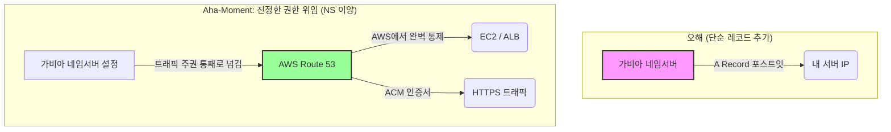

> [!NOTE]
> 이 글은 인프라 구축부터 CI/CD 배포까지 이어지는 SRE 트러블슈팅 대서사시의 두 번째 파트입니다.
> 1. [1/4] Terraform 파괴의 나비효과: 상태 불일치(Drift)와 소크라테스 디버깅
> 2. **[2/4] DNS 권한 위임과 ACM 전파 지연 트러블슈팅 (현재 글)**
> 3. [3/4] Terraform State 기억상실증과 Import 복구기
> 4. [4/4] 무중단 배포의 덫: GitHub Actions와 CodeDeploy 캐시 트러블슈팅

## 🏗️ 아키텍처 진화 (Architecture Evolution)

### ❌ 과거의 방식 (Mutable & ClickOps)
- 마우스 클릭으로 자원을 생성하고, 에러가 나면 콘솔에서 수동으로 자원을 삭제(ClickOps)하는 안티패턴.
- 인프라 생성(Terraform), 앱 배포(CodeDeploy), DB 스키마 주입(Hibernate ddl-auto)의 책임이 한데 뒤엉켜 있어 어디서 터졌는지 추적하기 힘든 구조.

### 🟢 진화된 방식 (Immutable & MSA Layering)
- **모놀리식(Monolithic) 분리**: 블로그 환경과 실습 환경을 분리하고, `Blog_Queue`를 통한 메시지 큐(MSA) 패턴 도입.
- **Immutable 인프라 도입의 필요성 인지**: 빈 깡통 EC2에 매번 스크립트로 설치(Mutable)하는 방식의 한계를 깨닫고 AMI 기반의 불변 인프라 아키텍처로 진화할 토대를 마련했습니다.
- **인프라와 앱 배포의 Lifecycle 철저 분리**: Terraform은 오직 '깡통 뼈대'만, DB 스키마는 Flyway가, 도커 실행 권한은 CodeDeploy가 전담하는 완벽한 책임 분리를 이뤄냈습니다.

---

## 🔍 Deep Dive: 핵심 트러블슈팅 분석

### 💥 DNS 권한 위임과 글로벌 전파 지연 (Taint & Replace)

> [!WARNING]
> **증상**
> 가비아에서 AWS Route53으로 네임서버 변경 후, ACM 인증서 검증(DNS Validation)이 30분 이상 지연되며 Terraform 배포가 무한 대기 상태(Hang)에 빠졌습니다.

전 세계 DNS에 전파되는 물리적 시간 지연과 더불어, AWS ACM 서버가 최초의 '검증 실패' 상태를 지독하게 캐싱(업무 태만)하고 있었습니다.

> [!TIP]
> **해결책**
> 멀쩡한 건물 뼈대(Route53)는 두고, 불량 서류(ACM)만 찢어 다시 제출하는 `terraform apply -replace="aws_acm_certificate.cert"` 명령어로 캐싱을 끊어내고 10초 만에 DNS 검증을 패스했습니다.

---

## 🗣️ 소크라테스 디버깅 일지

단순한 트러블슈팅 요약이 아닌, 문제를 마주하고 스스로 깨달음을 얻기까지의 **진짜 육성과 티키타카** 기록입니다.

### 💬 가비아 동사무소와 DNS 권한 위임의 늪

> **🙋‍♂️ 나의 첫 번째 오해**: "호스팅 영역을 팠고 NS 주소를 얻었으니, 당연히 가비아의 'DNS 관리' 창에 들어가서 A 레코드를 추가해야지!"
>
> **🤖 AI 튜터의 뼈때리는 역질문**: "아닙니다! 아키텍트님, 지금 하신 행동은 가비아 동사무소에 웹사이트 주소 포스트잇을 붙인 것입니다. 우리가 원하는 건 그게 맞나요?"
> 
> **💡 나의 Aha-Moment (깨달음)**: "아! 단순히 레코드(포스트잇)를 얹는 게 아니라, 아예 동사무소 소장 자리(트래픽 통제 주권) 자체를 통째로 AWS Route53으로 넘겨야 하는구나!"

결국 'DNS 설정'이 아닌 **'네임서버 설정'** 창에서 4개의 주소를 교체하며 완벽한 주권 이양에 성공했습니다. 이 과정을 다이어그램으로 시각화하면 다음과 같습니다.

---

## 🏗️ 파인만 비유 부록

> [!NOTE]
> **DNS 권한 위임 (NS 레코드 변경)**
> 동사무소 직원(가비아)에게 "이 주소는 여기야"라고 포스트잇을 적어주는 게 아닙니다. 아예 **동사무소 소장 자리(트래픽 통제권)**를 AWS Route53으로 통째로 위임(이사)하는 웅장한 아키텍처적 결단입니다.

---

## ⚖️ Trade-off (기술적 의사결정)

### `replace`를 통한 강제 갱신

| 결정 사항 | 포기한 것 (Cons) | 얻은 것 (Pros) |
| --- | --- | --- |
| **강제 갱신(Taint & Replace)** | Terraform이 알아서 해줄 것이란 막연한 믿음 | **지독한 캐싱에 갇힌 리소스의 Lifecycle을 인간이 직접 통제하는 제어력** |
