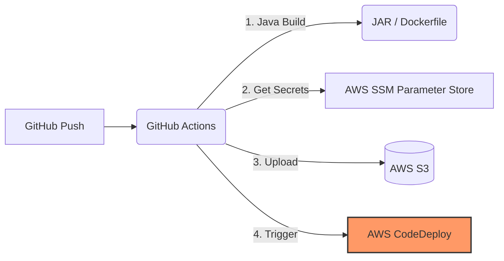
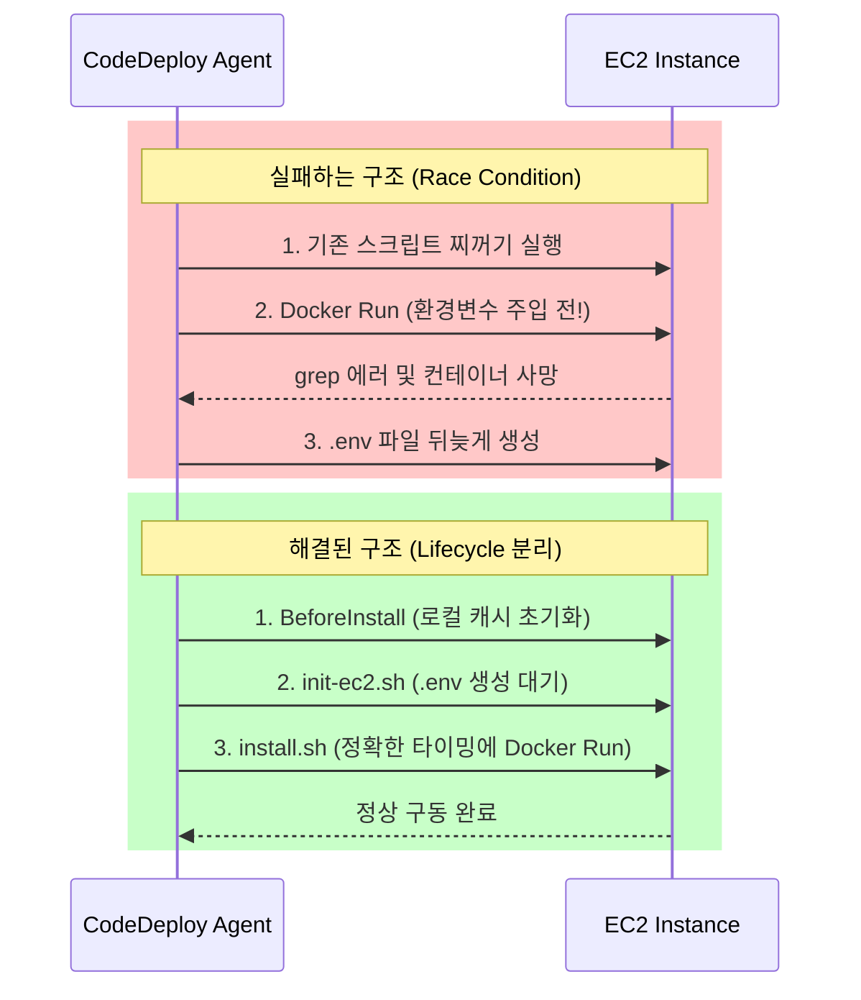

> [!NOTE]
> 이 글은 인프라 구축부터 CI/CD 배포까지 이어지는 SRE 트러블슈팅 대서사시의 마지막 파트입니다.
> 1. [1/4] Terraform 파괴의 나비효과: 상태 불일치(Drift)와 소크라테스 디버깅
> 2. [2/4] DNS 권한 위임과 ACM 전파 지연 트러블슈팅
> 3. [3/4] Terraform State 기억상실증과 Import 복구기
> 4. **[4/4] 무중단 배포의 덫: GitHub Actions와 CodeDeploy 캐시 트러블슈팅 (현재 글)**

## 1. 완벽한 인프라, 하지만 앱 배포의 벽

이전 연재들을 통해 단단하고 견고한 HTTPS 기반의 인프라(Terraform) 뼈대를 세웠습니다. 이제 그 위에 살을 붙일 차례입니다. GitHub Actions를 통해 S3에 빌드 파일을 올리고, AWS CodeDeploy를 트리거하여 EC2에 무중단 배포를 시도하는 과정의 피눈물 나는 기록입니다.

---

## 2. GitHub Actions 파이프라인의 눈물

### 💥 S3 업로드 실패의 늪

GitHub Actions 파이프라인을 구축하자마자 마주친 첫 번째 난관은 S3 업로드 권한이었습니다.

> [!WARNING]
> 빌드까지는 완벽했으나, AWS S3로 아티팩트를 밀어 넣는 단계(Upload to S3)에서 권한(IAM) 문제로 새빨간 에러를 뿜어냈습니다.

이 문제는 IAM Role과 OIDC(OpenID Connect) 트러스트 관계를 샅샅이 뒤져 권한 정책을 매핑함으로써 힘겹게 뚫어냈습니다. 단순 Access Key 발급이 아닌 OIDC를 통한 보안 강화를 이뤄낸 것에 의의가 큽니다.

### 🎯 SSM Parameter Store 연동 성공

비밀번호나 DB URL 같은 민감한 정보는 소스코드에 절대 하드코딩하지 않고, AWS Systems Manager(SSM) Parameter Store에서 런타임에 동적으로 주입받도록 설계했습니다. 수많은 실패를 딛고 초록색 체크마크(성공)를 띄워낸 파이프라인의 흐름은 다음과 같습니다.

---

## 3. Deep Dive: CodeDeploy 에이전트 캐시와 Race Condition

GitHub Actions 파이프라인을 무사히 통과하여 최종 배포 에이전트인 CodeDeploy가 작동을 시작했습니다. 그러나 가장 뼈아픈 트러블슈팅은 바로 EC2 내부의 CodeDeploy 에이전트에서 발생했습니다.

### 💥 배포는 성공했다는데 서버가 안 돌아간다?

> [!CAUTION]
> **증상 (Race Condition)**
> AWS 콘솔 상에서는 Event들이 Succeeded로 보이지만, 실제 스크립트 실행(ApplicationStart) 로그를 까보면 도커 컨테이너가 뻗어버린 기만적인 배포 실패 상황이 발생했습니다.
> 이전 배포의 불량 스크립트가 실행되거나, 환경 변수(`.env`) 파일이 생성되기도 전에 도커 배포 스크립트가 질주하여 `grep` 에러가 발생하며 서버가 뻗어버렸습니다.

이 Race Condition 상황을 Mermaid로 시각화해 보겠습니다.

> [!TIP]
> **해결책**
> `/opt/codedeploy-agent/deployment-root`에 찌들어 있는 CodeDeploy의 악랄한 로컬 캐시 구조를 파악했습니다. 배포의 Lifecycle을 철저히 분리하여, 패키지 설치를 담당하는 `init-ec2.sh`와 실제 실행 권한을 가진 `install.sh`의 타이밍을 엄격하게 통제하여 꼬인 흐름을 정상화했습니다.

---

## 🏗️ 파인만 비유 부록

> [!NOTE]
> **CodeDeploy 유령 식당**
> 서빙 직원(Agent)도 없는데 본사에서 호출하다가 타임아웃으로 미쳐버려 "옛날 요리 치우다 실패했어!"라고 유령 보고를 던진 에러.
>
> **AWS CLI Broken Pipe**
> 정수기 물줄기가 너무 강해 종이컵(페이저, `less`)을 끼워 넣었는데, 자동화 무인 공장(CI/CD)에서는 이 컵이 바로 터지면서 압력이 솟구쳐 파이프가 박살난(Broken Pipe) 에러.
> 
> **Flyway (깐깐한 금고지기)**
> 위험하게 DB를 조작하는 자동 번역기(Hibernate `ddl-auto: update`)와 달리, 개발자가 써준 결재 서류만 1번 읽어 장부에 적고 통과시키는 안전한 금고지기.

---

## ⚖️ Trade-off (기술적 의사결정)

### Flyway 스키마 관리 주입

| 결정 사항 | 포기한 것 (Cons) | 얻은 것 (Pros) |
| --- | --- | --- |
| **Flyway 스키마 관리 주입** | Spring Boot의 `ddl-auto: update`의 편리함 | **빈 깡통 인프라 주입 시 테이블 누락 방지 및 DB 배포 안정성 100% 보장** |
