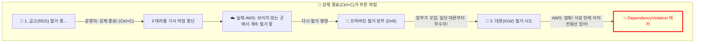

> [!NOTE]
> 콘솔 화면에서 마우스 클릭(ClickOps)으로 서버를 올리던 시절을 지나, 모든 인프라를 코드로 정의하는 **Terraform**을 도입했습니다. 이 글은 테라폼의 수명 주기(Lifecycle)를 오해하여 벌어진 상태 불일치(Drift) 사태와, 그 원인을 파고들어 코드로 무결성을 복구한 회고록입니다.

---

## 1. [Context & Issue] 배경 및 문제

빈 깡통 상태부터 일관되게 세팅되는 불변(Immutable) 인프라를 구축하기 위해 Terraform을 도입했습니다. 본격적인 코딩에 앞서, 프로젝트를 구성하는 각 파일들의 유기적인 역할을 먼저 정의했습니다.

*   **`providers.tf` (통신병)**: 테라폼이 다른 외부 자원들과 통신하기 위해 필요한 자격 증명 파일입니다.
*   **`main.tf` (총괄 지휘자)**: 통신병에게 *"나 이런 자원 만들 거니까 AWS한테 만들겠다고 말해서 승인받아와!"* 하고 지시합니다. 승인이 떨어지면 비로소 실제 AWS 자원을 생성하는 핵심 설계도입니다.
*   **`variables.tf` (보급관)**: 지휘자가 자원을 만들기 위해 필요한 값(인스턴스 타입, 비밀번호 등)을 동적으로 넣어주는 파일입니다.
*   **`outputs.tf` (전광판)**: 배포가 끝난 뒤, 사용자가 실제 AWS 자원이 잘 만들어졌는지 확인할 수 있도록 IP 주소 등의 결과값을 출력해 주는 파일입니다.

이렇게 뼈대를 세워 인프라를 구축한 후, 비용 절감을 위해 실습용 인프라를 허물고자 터미널에 `terraform destroy`를 실행했습니다. 

하지만 6분이 넘도록 콘솔 창이 응답하지 않았습니다. 저는 이를 단순한 시스템 멈춤(Hang)으로 오인하여 `Ctrl+C`로 프로세스를 강제 종료했습니다. 이후 다시 파괴 명령을 내린 순간 아래와 같은 에러가 발생했습니다.

> `DependencyViolation: Network vpc-... has some mapped public address(es)`

대문 역할을 하는 인터넷 게이트웨이(IGW) 철거가 완전히 가로막힌 상황이었습니다.

---

## 2. [Socratic Deep Dive] 원인 파악

### 🗣️ 소크라테스 디버깅 일지
> **🙋‍♂️ 나의 오해**: "이거 에러가 났는데, 루트 권한 같은 걸 써서 강제로 싹 지우는 명령어 치트키 없어?"
>
> **🤖 AI 튜터**: "클라우드 환경에서 의존성을 무시하고 강제로 삭제하는 치트키는 없습니다. AWS 건물주는 식당(VPC) 안에 전화선(네트워크 인터페이스)이 하나라도 남아있으면 절대 대문을 부수지 못하게 철벽 방어를 합니다."
>
> **💡 나의 깨달음**: "아! 테라폼이 멈춘 게 아니라, 무거운 금고(RDS)가 셧다운되고 묶인 전화선(ENI)들이 백그라운드에서 완전히 반환(Draining)되는 데 **물리적인 소요 시간**이 필요했던 거구나! 순서대로 안전하게 기다리고 있었는데, 내가 수동으로 프로세스를 끊어버린 거네."

---

## 3. [Alternatives & Trade-off] 의사결정

강제 종료했던 업보는 나중에 인프라를 다시 생성(apply)할 때 `Error: Already exists`라는 상태 불일치(Drift) 충돌로 이어졌습니다. 실제 AWS 클라우드에는 A 레코드가 존재하지만, Terraform의 상태 파일(`tfstate`)에는 기록이 누락된 것입니다. 이를 해결하기 위해 세 가지 대안을 고려했습니다.

| 해결 방안 | 장점 | 단점 | 최종 선택 |
| :--- | :--- | :--- | :--- |
| **1. AWS 콘솔에서 수동 삭제 (ClickOps)** | 당장의 에러를 가장 빠르게 회피 가능 | 인프라 코드의 무결성이 깨짐 (안티 패턴) | ❌ 배제 |
| **2. 테라폼 모듈 분리** | 의존성을 물리적으로 격리 가능 | 불필요하게 구조가 복잡해짐 | ❌ 배제 |
| **3. `terraform import` 사용** | 자원 파괴 없이 상태 파일에만 강제로 동기화 | 명령어가 다소 까다로움 | ✅ **채택** |

**결정 근거**: 운영 환경 자원을 마우스로 함부로 지워버리는 것은 단일 진실 공급원(SSOT)을 훼손하는 행동입니다. 저는 기존 자원을 파괴하지 않고 장부에 안전하게 편입시키는 `terraform import aws_route53_record.www ...` 명령을 선택하여 무결성을 방어했습니다.

---

## 4. [Resolution & Lesson] 결과 및 통찰

결과적으로 상태 파일을 완벽하게 동기화하여 정상적인 배포 사이클을 회복했습니다. 

이번 트러블슈팅을 통해 얻은 SRE/FinOps 관점의 통찰은 명확합니다. 인프라 파괴 시 콘솔 창의 멈춤이 답답하다고 강제 종료를 선택하면, 결국 수동으로 찌꺼기를 찾아 지워야 하는 막대한 디버깅 비용을 치르게 됩니다. 리소스의 연결이 완전히 정리되고 소멸(Zero State)할 때까지 기다리는 인내심이야말로, 불필요한 과금을 막는 **FinOps**의 기본 원칙임을 배웠습니다.
