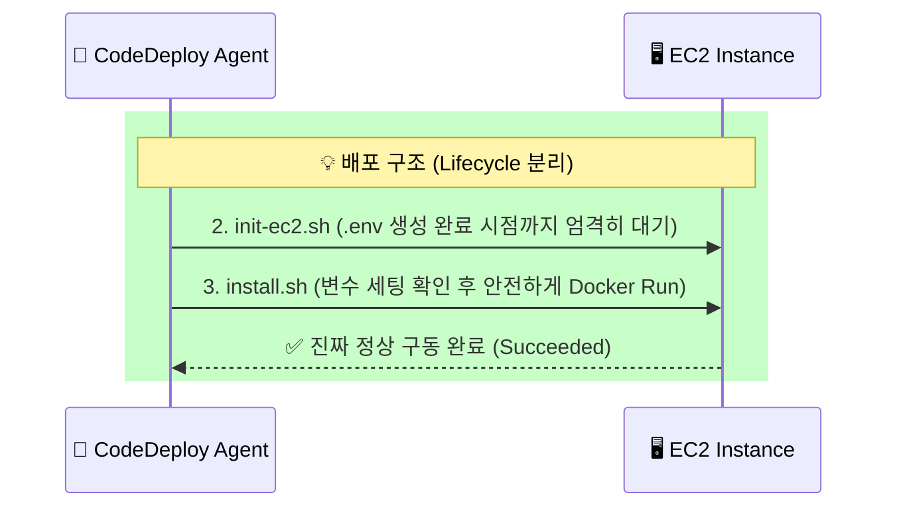

> [!NOTE]
> [1편]에서는 Terraform 상태 불일치를 복구하며 단단한 뼈대를 세웠습니다. 이번 글에서는 그 뼈대 위에 도메인을 연결하여 트래픽을 통제하고, CI/CD를 통해 실제 애플리케이션을 무중단으로 배포하며 겪은 캐시 및 Race Condition과의 사투를 회고합니다.

---

## 1. [Context & Issue] 배경 및 문제

완성된 인프라 위에 HTTPS 통신을 위한 도메인(Route53)과 인증서(ACM)를 붙여야 했습니다. 가비아에서 도메인을 구매한 후 가비아의 'DNS 관리' 창에 A 레코드를 추가하려 했으나 제대로 트래픽 제어가 되지 않았습니다.

도메인을 연결한 후에는 GitHub Actions와 CodeDeploy를 통해 애플리케이션 배포 파이프라인을 구축했습니다. 배포 에이전트는 `Succeeded` 상태를 반환했지만, 실제 운영 서버에 접속해 보니 애플리케이션이 구동되지 않고 죽어 있는 두 번째 문제에 직면했습니다.

---

## 2. [Socratic Deep Dive] 원인 파악

### 🗣️ 소크라테스 디버깅 일지 (DNS 위임)
> **🙋‍♂️ 나의 오해**: "가비아에서 도메인을 샀으니 당연히 가비아 쪽에 A 레코드를 추가하면 되겠지?"
>
> **🤖 AI 튜터**: "아닙니다! 지금 하신 행동은 가비아 동사무소에 웹사이트 주소 포스트잇을 하나 붙인 것에 불과합니다. 진정한 제어를 원하시나요?"
>
> **💡 나의 깨달음**: "아! 단순히 남의 집에 레코드를 얹어두는 게 아니라, 트래픽 통제 주권 자체를 통째로 AWS Route53으로 위임(Delegation)해야 하는구나!"

결국 'DNS 설정' 창이 아닌 **'네임서버 설정'** 창에서 4개의 주소를 교체함으로써 완벽한 주권 이양을 마쳤습니다.

### 🗣️ 소크라테스 디버깅 일지 (Race Condition)
> **🙋‍♂️ 나의 질문**: "배포가 성공으로 떴는데 왜 서버는 뻗어있지?"
>
> **💡 나의 깨달음**: "환경 변수(`.env`) 파일이 미처 만들어지기도 전에 도커 배포 스크립트가 실행되어 버린 **Race Condition(경쟁 상태)**이구나. 마치 서빙 직원도 아직 출근 안 했는데, 본사에서 요리를 내오라고 재촉하다가 식당이 뻗어버려 놓고선 '배포 성공'이라고 보고를 던진 **'유령 식당'** 같네."

---

## 3. [Alternatives & Trade-off] 의사결정

DNS 위임을 마쳤지만 `waiting for ACM Certificate` 상태로 검증이 무한 대기에 빠졌습니다. 전파 지연도 있었지만, 핵심은 AWS ACM 서버가 최초의 '검증 실패' 상태를 지독하게 캐싱하고 있다는 점이었습니다. 

이를 해결하기 위해 1) 무작정 전파를 기다리는 대안과 2) 강제 재생성을 하는 대안 중 후자를 택했습니다.
`terraform apply -replace="aws_acm_certificate.cert"` 명령어로 불량 서류(캐시)만 강제로 찢고 다시 제출(Taint)하여 단 10초 만에 DNS 검증을 패스했습니다.

추가로, 무중단 배포 시 데이터베이스 스키마 관리에 대한 의사결정도 필요했습니다.

| 대안 | 장점 | 단점 | 최종 선택 |
| :--- | :--- | :--- | :--- |
| **Spring Boot `ddl-auto: update`** | 로컬 개발 시 매우 편리함 | 운영 환경에서 데이터 손실의 시한폭탄 위험 | ❌ 배제 |
| **Flyway 도입** | 명시적인 버전 관리로 스키마 충돌 방어 | 러닝 커브와 스크립트 관리 비용 발생 | ✅ **채택** |

**결정 근거**: 운영(Prod) 환경의 무결성을 위해 편리함을 과감히 포기하고, 깐깐한 금고지기인 Flyway를 도입하여 DB 충돌과 데이터 유실을 100% 방어했습니다.

---

## 4. [Resolution & Lesson] 결과 및 통찰

도메인 트래픽의 완전한 통제와 무중단 배포 스크립트의 수명 주기(Lifecycle) 분리를 통해, 오작동 없는 견고한 CI/CD 파이프라인을 구축했습니다.

이 과정에서 인프라는 한 번 배포하면 끝나는 것이 아님을 뼈저리게 느꼈습니다. SRE 엔지니어는 지독한 캐싱(ACM 검증)을 의도적으로 깰 줄 알아야 하며, 배포 스크립트의 Race Condition을 제어하기 위해 자원의 라이프사이클을 계층화(Layering)하는 아키텍처 철학이 필수적이라는 교훈을 얻었습니다.
