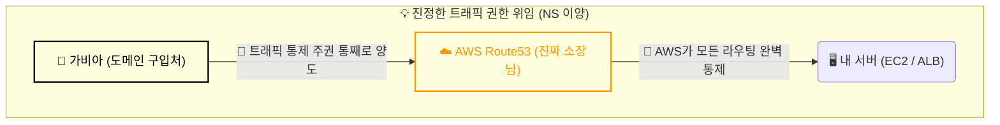

> [!NOTE]
> [1편]에서는 Terraform 상태 불일치를 복구하며 단단한 뼈대를 세웠습니다. 이번 글에서는 그 뼈대 위에 도메인을 연결하여 트래픽을 통제하며 겪은 DNS 권한 위임과 악랄한 캐시(Cache)와의 사투를 회고합니다.

---

## 1. [Context & Issue] 배경 및 문제

완성된 인프라 위에 HTTPS 통신을 위한 도메인(Route53)과 인증서(ACM)를 붙여야 했습니다. 가비아에서 도메인을 구매한 후, 가비아의 'DNS 관리' 창에 A 레코드를 추가하려 했으나 제대로 트래픽 제어가 되지 않는 문제가 발생했습니다.

또한, 트래픽 연결 이후에도 터미널에 `waiting for ACM Certificate` 메시지가 출력되며 인증서 검증 프로세스가 무한 대기(Hang) 상태에 빠지는 현상에 직면했습니다.

---

## 2. [Socratic Deep Dive] 원인 파악

### 🗣️ 소크라테스 디버깅 일지 (DNS 위임)
> **🙋‍♂️ 나의 오해**: "가비아에서 도메인을 샀으니, 당연히 가비아 DNS 설정 쪽에 A 레코드를 추가하면 연결이 되겠지?"
>
> **🤖 AI 튜터**: "아닙니다! 지금 하신 행동은 가비아 동사무소에 웹사이트 주소 포스트잇을 하나 붙인 것에 불과합니다. 진정한 트래픽 제어를 원하시나요?"
>
> **💡 나의 깨달음**: "아! 단순히 남의 집에 레코드를 얹어두는 게 아니라, 아예 동사무소 소장 자리, 즉 **트래픽 통제 주권 자체를 통째로 AWS Route53으로 위임(Delegation)**해야 하는구나!"

결국 'DNS 설정' 창이 아닌 **'네임서버 설정'** 창에서 4개의 NS 주소를 교체함으로써 완벽한 주권 이양을 마쳤습니다.

---

## 3. [Alternatives & Trade-off] 의사결정

DNS 위임을 마쳤지만 `waiting for ACM Certificate` 상태로 검증이 무한 대기에 빠졌습니다. 글로벌 DNS 전파 지연도 원인이었지만, 핵심은 AWS ACM 서버가 최초의 '검증 실패' 상태를 지독하게 캐싱하고 있다는 점이었습니다. 

이를 해결하기 위해 두 가지 대안을 고려했습니다.

| 대안 | 장점 | 단점 | 최종 선택 |
| :--- | :--- | :--- | :--- |
| **1. 캐시가 만료될 때까지 무작정 대기** | 추가적인 작업 불필요 | 배포 파이프라인이 기약 없이 블로킹됨 | ❌ 배제 |
| **2. `terraform apply -replace` 사용** | 즉각적인 캐시 초기화 (Taint) | 테라폼 명령어를 강제로 주입해야 함 | ✅ **채택** |

**결정 근거**: 인프라 파이프라인에서 가장 중요한 것은 '예측 가능성'입니다. 무작정 기다리는 것은 SRE의 태도가 아닙니다. 저는 `terraform apply -replace="aws_acm_certificate.cert"` 명령어로 불량 서류(캐시)만 강제로 찢고 다시 제출(Taint)하는 주도적인 방식을 택하여, 단 10초 만에 DNS 검증을 패스했습니다.

---

## 4. [Resolution & Lesson] 결과 및 통찰

가비아로부터 트래픽 주권을 완전히 이양받고, 끈질기게 발목을 잡던 ACM 캐시를 의도적으로 타격(Taint)함으로써 안정적인 HTTPS 도메인 통제권을 확보했습니다.

이번 과정을 통해 영구적인 자원(도메인)과 가변적인 자원(앱)의 라이프사이클을 이해하게 되었습니다. 또한 SRE 엔지니어는 인프라 도구가 언젠가 알아서 해결해 주겠지라는 막연한 기대감을 버리고, 지독한 **캐싱 메커니즘을 명시적으로 제어**할 수 있어야 한다는 뼈저린 교훈을 얻었습니다. 이 단단한 네트워크 주권 위에 무중단 배포(CodeDeploy)를 올리며 겪은 쉘 스크립트 디버깅 이야기는 마지막 3편에서 이어집니다.
