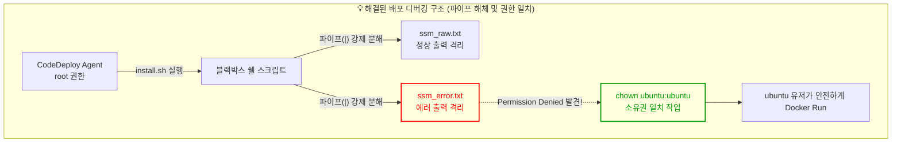

> [!NOTE]
> 수동 스크립트 배포의 한계(롤백 불가, 다운타임 발생)를 극복하기 위해 AWS CodeDeploy 기반의 In-Place(롤링) 무중단 배포를 도입했습니다. 이 글은 그 과정에서 마주한 악랄한 권한(Permission) 충돌과 블랙박스 같았던 쉘 스크립트 파이프라인(`|`)을 해체하여 디버깅한 회고록입니다.

---

## 1. [Context & Issue] 배경 및 문제

도메인 트래픽 제어를 완벽히 마친 후, GitHub Actions와 CodeDeploy를 연동하여 애플리케이션 배포 파이프라인을 구축했습니다.

하지만 배포 과정에서 CodeDeploy Agent가 `install.sh` 스크립트를 실행하다가 파라미터 스토어(SSM) 값 추출에 계속 실패하며 뻗어버리는 문제가 발생했습니다. 에러 로그를 봐도 `jq` 파싱 에러라고만 뭉뚱그려져 나와 정확한 원인을 파악하기 힘들었습니다. 게다가 어떤 때는 배포 에이전트가 `Succeeded` 초록불을 띄웠음에도 불구하고, 실제 서버에 접속해 보면 애플리케이션이 구동되지 않고 죽어 있는 복합적인 문제에 직면했습니다.

---

## 2. [Socratic Deep Dive] 원인 파악

### 🗣️ 소크라테스 디버깅 일지 (파이프 해체와 chown의 비밀)

**[Phase 1: 블랙박스가 되어버린 쉘 스크립트]**
> **🙋‍♂️ 나의 질문**: "배포가 자꾸 실패하는데, 로그를 봐도 `jq` 파싱 에러라고만 나오고 정확히 어디서 막힌 건지 안 보여. `aws ssm get-parameter | jq` 이 한 줄에서 대체 뭐가 문제인 거지?"
>
> **🤖 AI 튜터**: "에러가 한 줄로 뭉개져서 보인다면, 그 뭉개진 파이프(`|`)를 분해해 보면 어떨까요? 데이터를 한 번에 가공하려 하지 말고, 일단 날것(Raw) 그대로 텍스트 파일에 쏟아내 봅시다."

**[Phase 2: 파이프(|) 해체 작업과 권한 충돌의 발견]**
> **🙋‍♂️ 나의 깨달음**: "그래, 파이프를 없애고 `ssm_raw.txt`랑 `ssm_error.txt`로 출력을 완전히 격리해 봤어. 어?! 에러 파일에 'Permission Denied'가 찍혀있네? EC2 안에서 스크립트가 실행되는 건데 왜 권한이 없지?"
>
> **🤖 AI 튜터**: "아주 날카로운 발견입니다! 스크립트를 '누가' 실행하고 있는지 고민해 보세요. 우리가 평소에 SSH로 접속하는 사용자와, CodeDeploy Agent가 뒤에서 몰래 스크립트를 돌릴 때의 사용자가 과연 같을까요?"

**[Phase 3: Aha-Moment! 아! 이게 이런 구조였구나!]**
> **💡 나의 깨달음**: "아! CodeDeploy Agent는 기본적으로 `root` 권한으로 스크립트를 냅다 실행해 버리는구나! 
> 
> 내가 EC2에 접속해서 쓰는 건 `ubuntu` 계정인데, CodeDeploy가 `root` 권한으로 `.env` 파일이나 폴더를 막 생성해 버리니까 나중에 `ubuntu` 계정으로 돌아가는 애플리케이션(도커)이 그 파일을 못 읽어서 뻗었던 거였어! 거기다 환경 변수 파일이 미처 세팅되기도 전에 도커가 실행되는 Race Condition(경쟁 상태)까지 겹쳤던 거지. 와, 블랙박스 같던 쉘 스크립트를 분해하고 실행 주체를 맞추니까(`chown ubuntu:ubuntu`) 에러가 싹 사라지네!"

---

## 3. [Alternatives & Trade-off] 의사결정

CI/CD 파이프라인을 구축하며 두 가지 굵직한 아키텍처 의사결정을 내렸습니다.

### 1) 배포 전략: 블루/그린 vs 롤링(In-Place)
*   **블루/그린 배포**: 다운타임이 0초지만, 서버 인프라를 2배로 유지해야 하므로 소규모 프로젝트에서는 엄청난 비용 낭비(Over-provisioning)를 초래합니다.
*   **롤링 배포 (채택)**: 1대씩 트래픽을 차단하고 업데이트하는 방식으로 추가 인프라 비용이 0원입니다. 배포 중 남은 서버에 부하가 집중된다는 단점이 있지만, 현재 단계에서는 **인프라 비용 최적화(FinOps)**가 최우선이므로 롤링 배포를 채택했습니다.

### 2) 데이터베이스 스키마 관리: `ddl-auto` vs Flyway
*   **Spring Boot `ddl-auto: update`**: 로컬에서는 편하지만 운영 환경에서는 데이터 유실의 시한폭탄입니다.
*   **Flyway 도입 (채택)**: 무중단 배포 시 발생할 수 있는 DB 스키마 충돌 방어를 위해 명시적인 버전 관리 도구를 채택했습니다.

---

## 4. [Resolution & Lesson] 결과 및 통찰 (STAR-F 면접 방어)

결과적으로 파이프라인 로그를 격리하고 권한을 일치시킴으로써 뻗어버리던 배포 스크립트를 완벽하게 안정화했습니다. 

**Q. CI/CD 파이프라인에서 배포 스크립트(CodeDeploy) 실패 시 어떻게 트러블슈팅을 진행했나요?**

*   **Situation**: CodeDeploy를 통한 무중단 배포 도입 중, `install.sh` 스크립트가 파라미터 스토어(SSM) 값을 불러오는 과정에서 계속 실패했습니다.
*   **Task**: 에러 로그가 `jq` 파싱 에러로 뭉뚱그려져 나와 근본 원인(Root Cause)을 찾아야 했습니다.
*   **Action**: 
    1. 가장 먼저 한 줄로 묶여있던 쉘 스크립트의 파이프(`|`)를 강제로 해체하여, 정상 출력과 표준 에러(stderr)를 각각 독립된 텍스트 파일(`ssm_raw.txt`, `ssm_error.txt`)로 격리시켜 블랙박스를 열었습니다.
    2. 격리된 로그를 통해 'Permission Denied'를 확인했고, CodeDeploy Agent가 `root` 권한으로 파일을 생성하여 실제 앱을 구동하는 `ubuntu` 유저와 권한 충돌이 발생함을 깨달았습니다. 
    3. 스크립트 실행 후 생성된 자산들에 `chown`을 명시적으로 적용하여 소유권을 일치시켰습니다.
*   **Result (FinOps/SRE)**: 이를 통해 스크립트 기반 배포의 고질적인 권한 꼬임 문제를 해결하여 안정적인 롤링 배포를 완성했으며, 복잡한 파이프라인 디버깅 시 **'관심사의 분리와 로그 격리'**가 얼마나 중요한지 SRE 관점에서 뼈저리게 깨달았습니다.
