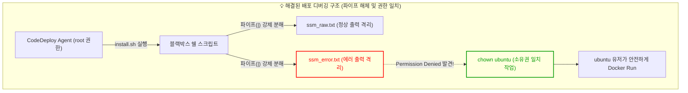

> [!NOTE]
> 수동 스크립트 배포의 한계(다운타임 발생, 롤백 불가)를 극복하기 위해 AWS CodeDeploy 기반의 롤링(In-Place) 무중단 배포를 도입했습니다. 하지만 그 과정은 결코 순탄치 않았습니다. 유령 식당 에러부터 Race Condition, 권한 충돌까지... 뼈아픈 트러블슈팅 끝에 '불변 인프라(Immutable Infrastructure)'의 진정한 의미를 깨달은 회고록입니다.

---

## 1. [Context & Issue] 배경 및 문제

도메인 트래픽 제어를 마친 후, GitHub Actions와 CodeDeploy를 연동하여 배포 파이프라인을 구축했습니다. 호기롭게 푸시를 날렸으나, 배포는 번번이 참사로 이어졌습니다.

1. **유령 식당 에러**: 첫 배포인데도 CodeDeploy 에이전트가 예전 캐시 찌꺼기를 물고 `ApplicationStop` 단계에서 존재하지도 않는 폴더로 진입하다가 터졌습니다.
2. **Race Condition (경쟁 상태)**: 깡통 EC2가 뜨자마자 도커(Docker)를 설치하기도 전에 CodeDeploy가 배포를 시도하여 터지는 현상이 발생했습니다.
3. **권한 충돌과 파이프라인 블랙박스**: 스크립트 실행 중 SSM 파라미터 스토어 값 추출에 실패하며 뻗어버렸고, 에러 로그는 뭉개져 있었습니다.

---

## 2. [Socratic Deep Dive] 원인 파악

### 🗣️ 소크라테스 디버깅 일지 1: 유령 식당과 방어 코드
> **🙋‍♂️ 나의 오해**: "처음 배포하는 거라 이전 컨테이너가 없는데, 왜 자꾸 `ApplicationStop`에서 디렉토리가 없다고 죽는 거지?"
>
> **🤖 AI 튜터**: "CodeDeploy는 무조건 이전 배포 내역(캐시)의 `stop.sh`를 먼저 실행하려 듭니다. 없는 식당(폴더) 문을 억지로 열려니까 에러가 나는 겁니다."
>
> **💡 나의 깨달음**: "아! 그러니까 디렉토리가 있을 때만 들어가서 컨테이너를 내리는 방어 코드를 짜야겠네!"

```bash
# 변경 전 (유령 식당 에러 유발)
cd /home/ubuntu/cover-challenge
sudo docker-compose down

# 변경 후 (방탄 스크립트 적용)
if [ -d "/home/ubuntu/cover-challenge" ]
then
    cd /home/ubuntu/cover-challenge
    sudo docker-compose -f docker-compose.prod.yml down || true
fi
```

### 🗣️ 소크라테스 디버깅 일지 2: Race Condition과 불변(Immutable) 인프라
> **🙋‍♂️ 나의 오해**: "EC2 뜰 때 UserData(`init-ec2.sh`)로 도커 깔게 해놨는데, 왜 CodeDeploy가 도커가 없다고 뻗지?"
>
> **🤖 AI 튜터**: "도커 설치가 완료되기 전에 CodeDeploy 에이전트가 배포 스크립트(`install.sh`)를 냅다 실행해 버렸기 때문입니다. 달리기 시합에서 신발도 안 신었는데 출발 신호가 울린 셈이죠."
>
> **💡 나의 깨달음**: "그렇구나! 패키지 설치(`init-ec2.sh`)와 앱 실행(`install.sh`)의 책임을 완벽히 분리(MSA)해야 해. **CodeDeploy 에이전트 설치 명령어 자체를 `init-ec2.sh`의 가장 마지막 줄로 옮겨서**, 도커 설치가 끝난 뒤에만 에이전트가 눈을 뜨게(Start) 만들자!"
>
> **🔥 Aha-Moment**: "잠깐만... 이렇게 깡통 서버가 뜰 때마다 60줄짜리 스크립트로 도커 깔고 깃 까는 짓(Mutable) 자체가 너무 불안정하고 느리잖아? 아! 이래서 다들 미리 다 깔아둔 **불변 인프라(AMI, Immutable)**를 써서 구워놓는 거구나!"

### 🗣️ 소크라테스 디버깅 일지 3: 파이프 해체와 chown
> **🙋‍♂️ 나의 질문**: "배포 스크립트 `aws ssm get-parameter | jq` 이 한 줄에서 대체 뭐가 문제인지 에러가 안 보여."
>
> **🤖 AI 튜터**: "파이프(`|`)가 에러를 뭉개고 있다면 강제 분해해 보세요. 날것(Raw) 그대로 파일에 쏟아내 격리해 봅시다."
>
> **💡 나의 깨달음**: "파이프를 없애고 `> ssm_raw.txt 2> ssm_error.txt`로 격리했더니 Permission Denied가 보이네! CodeDeploy Agent는 `root` 권한으로 파일을 막 생성해버리니까, 실제 앱 구동 유저인 `ubuntu`가 권한 충돌로 뻗었던 거야! `chown ubuntu:ubuntu /home/ubuntu/cover-challenge` 한 줄로 해결되다니!"



---

## 3. [Alternatives & Trade-off] 의사결정

CI/CD 파이프라인을 구축하며 두 가지 굵직한 아키텍처 의사결정을 내렸습니다.

### 1) 배포 전략: 블루/그린 vs 롤링(In-Place)
*   **블루/그린 배포**: 다운타임이 0초지만, 서버 인프라를 2배로 유지해야 하므로 소규모 프로젝트에서는 비용 낭비(Over-provisioning)를 초래합니다.
*   **롤링 배포 (채택)**: 1대씩 트래픽을 차단하고 업데이트하여 추가 인프라 비용이 0원입니다. 현재 단계에서는 **인프라 비용 최적화(FinOps)**가 최우선이므로 롤링 배포를 채택했습니다.

### 2) 데이터베이스 스키마 관리: `ddl-auto` vs Flyway
*   **Spring Boot `ddl-auto: update`**: 로컬에서는 편하지만 운영 환경에서는 데이터 유실의 시한폭탄입니다.
*   **Flyway 도입 (채택)**: 무중단 배포 시 발생할 수 있는 DB 스키마 충돌 방어를 위해 명시적인 버전 관리 도구를 채택했습니다.

---

## 4. [Resolution & Lesson] 결과 및 통찰 (STAR-F 면접 방어)

**Q. CI/CD 파이프라인에서 CodeDeploy 배포 실패 시 어떻게 트러블슈팅을 진행했나요?**

*   **Situation**: CodeDeploy 롤링 배포 도입 중, 1) 첫 배포 시 `ApplicationStop` 폴더 부재 에러, 2) 도커 미설치 상태에서 배포가 시작되는 Race Condition, 3) 파라미터 스토어 파싱 실패 권한 충돌이라는 복합적인 문제에 직면했습니다.
*   **Task**: 각 문제의 근본 원인(Root Cause)을 찾아 배포 파이프라인을 안정화해야 했습니다.
*   **Action**: 
    1. **유령 식당**: `if [ -d "$TARGET_DIR" ]` 방어 코드를 작성하여 폴더 유무를 검증했습니다.
    2. **Race Condition**: `init-ec2.sh`의 패키지 설치와 CodeDeploy 에이전트 구동 순서를 분리하여 책임을 명확히 했습니다.
    3. **파이프 해체와 chown**: 쉘 스크립트 파이프(`|`)를 강제 해체해 표준 에러를 `ssm_error.txt`로 격리했고, CodeDeploy(root)와 실제 앱 유저(ubuntu) 간의 권한 꼬임을 `chown`으로 일치시켰습니다.
*   **Result (FinOps/SRE)**: 이를 통해 고질적인 쉘 스크립트 기반 배포 문제들을 해결하고 안정적인 무중단 배포를 달성했습니다. 특히 서버가 뜰 때마다 스크립트로 셋업하는 것(Mutable)의 한계를 체감하며, 향후 **AMI 기반 불변 인프라(Immutable Infrastructure)**로 진화해야 한다는 명확한 통찰을 얻었습니다.
