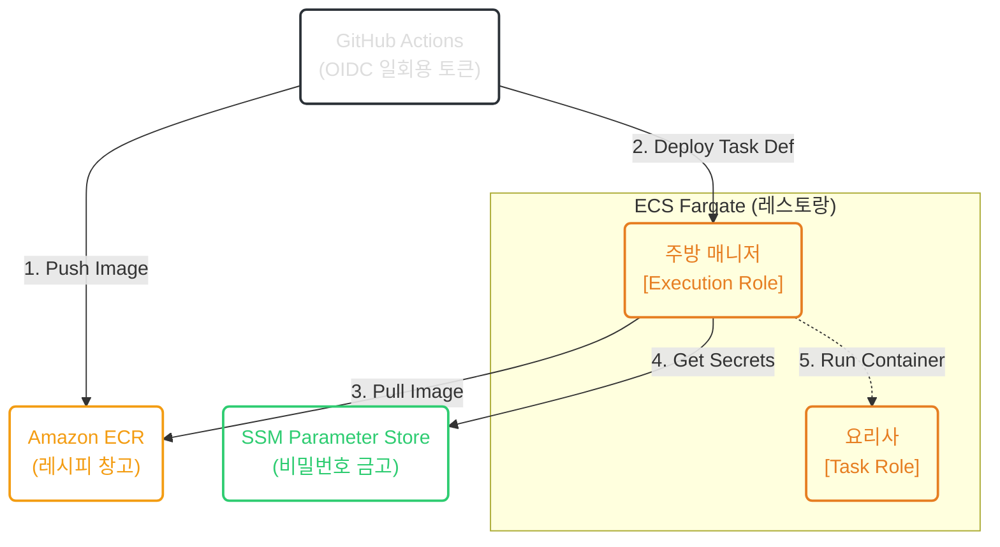

> [!NOTE]
> 본 포스팅은 EC2 기반의 레거시(CodeDeploy)에서 탈피하여 ECS Fargate 서버리스 환경으로 CI/CD를 전환하며 맞닥뜨린 IAM 권한 분리와 Secret Management 딜레마의 트러블슈팅을 다룹니다.

## 1. Context & Issue (배경 및 문제)
인프라를 EC2 기반에서 완벽한 도커 기반 Serverless(Fargate)로 마이그레이션하면서, 기존의 CI/CD 파이프라인은 무용지물이 되었습니다. 
서버리스 환경에서는 EC2처럼 머신 내부에 CodeDeploy 에이전트를 설치할 수 없으므로(Immutable CI/CD), 컨테이너 이미지 자체를 통째로 갈아끼우는 새로운 배포 파이프라인(ECR Push ➔ Task Definition 렌더링 ➔ ECS Service 업데이트)이 필요했습니다.
하지만 이 과정에서 세 가지 치명적인 장벽에 부딪혔습니다.
1. **보안의 위협**: GitHub Actions에 AWS Access Key를 복사해 두면, 키 유출 시 해커가 인프라 전체를 장악(Blast Radius)할 수 있는 위험성.
2. **비밀번호 관리**: DB 주소를 평문(`environment`)으로 넘길 경우 `tfstate`와 런타임에 암호가 영구 박제되는 참사.
3. **닭과 알의 딜레마**: ECR이 비어있으면 ECS 생성 시 무한 재시작 에러가 발생하고, ECS가 없으면 ECR에 배포할 곳이 없는 프로비저닝 병목.

## 2. Socratic Deep Dive (원인 파악)
AI 튜터의 파인만 비유와 예리한 압박 질문을 통해 배포 흐름과 IAM의 본질을 파헤쳤습니다.

- **나의 오해**: `docker push`를 하면 즉시 배포가 끝나는 줄 알았고, DB 주소는 편하게 환경 변수로 넘기고, OIDC Role ARN도 안전하게 AWS SSM에 넣고 가져오면 될 것이라 생각했다.
- **튜터의 팩트체크**: SSM에서 값을 읽어오려면 우선 'AWS 인증'이 필요한데, 인증을 위한 열쇠(OIDC ARN)를 인증이 필요한 SSM에서 꺼내려는 순환 참조(Circular Dependency) 무한 루프에 빠지지 않았는가? 또한, 컨테이너가 켜지기도 전에 이미지를 당겨오는 건 누구의 권한인가?
- **나의 깨달음 (레스토랑 비유와 IAM 분리)**: 아! ECR은 '레시피 창고', ECS는 '매니저', Fargate는 '주방'이구나. 컨테이너가 켜지기 전 SSM(금고)에서 비밀번호를 꺼내고 ECR에서 이미지를 가져오는 건 요리사(Task Role)가 아니라 매니저(Execution Role)다. 금고 열쇠는 반드시 Execution Role에 쥐어줘야 한다! 





## 3. Alternatives & Trade-off (의사결정)

1. **Access Key 하드코딩 vs OIDC 일회용 토큰** ⭐ **선택**
   - Access Key는 유출 시 대형 사고(과금 폭탄)로 이어지지만, OIDC는 GitHub Actions가 배포할 때만 AWS에 "나 인증됐으니 일회용 토큰(STS) 줘"라고 요구하여 아주 짧은 시간만 권한을 얻습니다. 보안을 위해 **OIDC 기반 인증**을 채택했습니다. (단, 순환 참조를 막기 위해 OIDC ARN 자체는 GitHub Secrets에 격리)
2. **평문 환경변수 vs SSM Parameter Store Decoupling** ⭐ **선택**
   - 평문 하드코딩의 참사를 막기 위해 SSM `SecureString`으로 DB 정보를 암호화하고, 컨테이너 런타임에 Execution Role이 복호화해서 주입하는 의존성 분리(Decoupling) 방식을 택했습니다.
3. **Dummy Image (마네킹) 패턴 도입**
   - 텅 빈 ECR로 인한 무한 재시작 에러를 막기 위해, Terraform에서는 임시로 `nginx:alpine` 마네킹을 세워 건물 사용 승인을 받은 뒤, GitHub Actions가 진짜 애플리케이션 이미지를 갈아끼우는 방식으로 닭과 알의 딜레마를 타파했습니다.

또한, GitHub Actions 환경(ephemeral 러너)에서 발생하는 레이어 캐시 증발 현상으로 인한 빌드 지연을 막기 위해, ECR을 캐시 백엔드로 삼아 `--cache-from`을 활용하는 FinOps 튜닝을 적용했습니다.

## 4. Resolution & Lesson (결과 및 면접 방어)
이 과정을 통해 수동 개입이 전혀 필요 없는 보안등급 1티어 수준의 서버리스 CI/CD 파이프라인을 구축했습니다.

- **Security/IAM 관점**: Execution Role과 Task Role을 완벽히 분리하여 최소 권한(Least Privilege) 원칙을 증명했습니다. GitHub Actions가 AWS에 영구적인 백도어(Access Key)를 만들지 않고 OIDC라는 일회용 출입증으로만 통신하도록 Blast Radius(폭발 반경)를 최소화했습니다.
- **FinOps/SRE 관점**: 캐시 백엔드를 ECR로 돌려 GitHub 빌드 시간을 극적으로 단축시켰고, 레시피(ECR)와 주방(ECS)을 분리함으로써 `docker push`만으로는 서버가 배포되지 않는 구조적인 무중단 배포 본질을 체화했습니다.
