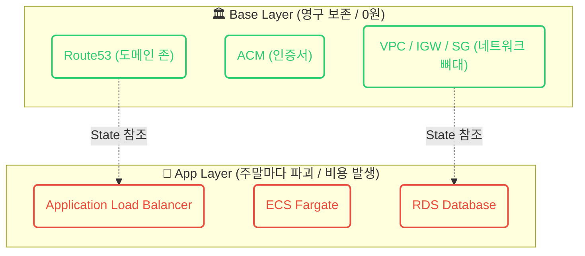

> [!NOTE]
> 본 포스팅은 AWS 인프라를 Terraform으로 구축하며 맞닥뜨린 비용 누수(FinOps) 문제와 DNS 프로비저닝 데드락을 극복하기 위한 SRE 관점의 의사결정 과정을 담았습니다.

## 1. Context & Issue (배경 및 문제)
AWS 환경에서 Terraform으로 인프라를 구축하며 가장 먼저 마주친 벽은 **요금 청구서**와 **프로비저닝 데드락(Deadlock)**이었습니다. 
초기에는 관리를 편하게 하고자 `Route53`, `ACM`, `ALB`, `EC2`, `RDS` 등 모든 인프라를 단일 State 파일에 관리했습니다. 그러나 이 구조는 치명적인 두 가지 한계를 드러냈습니다.
첫째, 주말 실습이 끝난 후 과금을 막기 위해 `terraform destroy`를 날리면 0원이어야 할 고정 네트워크 자원(Route53 등)까지 전부 파괴되었습니다.
둘째, 전체 인프라를 한 번에 띄울 때 Route53 도메인 생성 직후 ACM 인증서 검증(무한 대기) 단계에 돌입해버려, 정작 도메인 등록처에 입력해야 할 네임서버(NS) 레코드를 콘솔에 출력받을 타이밍이 없는 **DNS 데드락**이 발생했습니다.

## 2. Socratic Deep Dive (원인 파악)
문제를 해결하기 위해 AI 튜터와 함께 시스템의 본질을 파헤치는 과정을 거쳤습니다.

- **나의 오해**: EC2는 볼륨(EBS)을 안 달면 요금이 0원일 것이고, 인프라를 한 파일에 모두 넣어야 관리가 편할 것이라고 생각했다. 불필요한 리소스는 AWS 콘솔에서 마우스로 클릭(ClickOps)해서 지우면 되지 않을까?
- **튜터의 팩트체크**: 클라우드의 과금은 '컴퓨터 전원이 켜진 시간' 기준이다! 또한 DNS 글로벌 전파 시간(최대 48시간) 동안 도메인이 먹통이 되는데 매번 네임서버를 갱신할 것인가? 사람이 마우스로 지울 때 발생할 누락(고아 리소스)은 어떻게 책임질 것인가?
- **나의 깨달음**: "아! 닭과 알의 딜레마이자 수명의 문제구나." 수명이 긴 `base`(Route53 등)와 과금이 발생하는 가변적인 `app`(ALB, ECS, RDS)으로 State를 격리(State Layering)해야 한다. 그리고 인간의 개입 없이 터미널에서 CLI로 비동기 폭격(파괴)을 가하는 **Zero-ClickOps**만이 완벽한 정답이다.

## 3. Alternatives & Trade-off (의사결정)
DNS 데드락과 비용 방어를 위해 몇 가지 선택지를 놓고 고민했습니다.

1. **대안 A: 단일 State + `-target` 배포 유지**
   - **장점**: 파일 구조가 단순함.
   - **단점**: 매번 배포할 때마다 `-target`으로 순서를 외워서 쳐야 하며, 실수로 전체 `destroy`를 누르는 순간 DNS 존이 날아가 복구에 48시간이 소요되는 대참사 발생.
2. **대안 B: State Layering (Base / App 분리)** ⭐ **선택**
   - **장점**: 수명 주기에 따른 격리. 주말마다 과금이 발생하는 `app` 디렉토리만 안전하게 `destroy`하여 비용 방어 완벽 달성. DNS는 `base`에 안전하게 남아있음.
   - **단점**: 디렉토리 분리로 인해 Remote State Data Source를 사용해 의존성을 연결해 줘야 하는 초기 구현 복잡도 존재.

또한 삭제 방식에 대해서도, 콘솔 화면에서의 **ClickOps**를 전면 배제하고 AWS CLI 및 Terraform만을 활용하는 **Zero-ClickOps** 방식을 도입하여 도커 기반 Serverless 인프라로의 이전을 위한 레거시 코드 100% 정화를 이뤄냈습니다.

## 4. Resolution & Lesson (결과 및 면접 방어)
이러한 State 분리 아키텍처를 통해 **주말 인프라 유지 비용을 0원으로 수렴**시키는 완벽한 FinOps 파이프라인을 구축했습니다.

- **FinOps 관점**: 클라우드 비용의 본질은 'Running Hours'임을 깨닫고, 0원인 자원(IGW, VPC)과 돈을 먹는 하마(NAT, ALB, RDS)를 철저히 분류했습니다. `provider` 단에서 `default_tags`를 주입해 모든 자원의 비용 추적을 자동화했습니다.
- **SRE 관점**: State 파일이 유실되거나 꼬였을 때 콘솔에서 롤백하는 것이 아니라, `git checkout`으로 과거 코드로 돌아간 뒤 `apply`하여 Terraform 스스로 고아 리소스를 역산해 파괴하도록 하는 **GitOps 기반의 롤백 전략**을 체화했습니다. 이는 장애 상황에서 엔지니어가 겪는 인지 부하(Cognitive Load)를 최소화하고 예측 가능한 인프라 운영을 가능하게 합니다.
