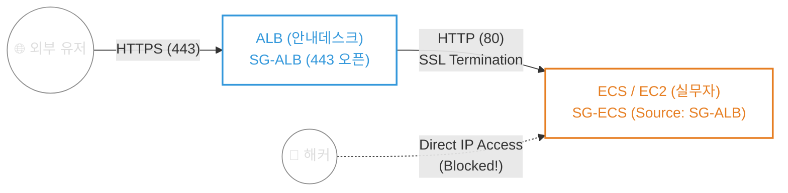

> [!NOTE]
> 단지 포트를 막는 수준을 넘어, 오직 허가된 컴포넌트 간의 통신만 허용하는 진정한 의미의 Zero-Trust 아키텍처를 AWS Security Group Chaining으로 구현한 과정을 담았습니다.

## 1. Context & Issue (배경 및 문제)
AWS에서 웹 서비스를 배포할 때 가장 흔히 하는 착각은 "80 포트는 443으로 리다이렉트 시키고, 443 포트만 열어두면 보안이 된다"는 것입니다.
초기 인프라 설계 시, 퍼블릭에 EC2를 두고 단순 포트 제어만으로 시스템을 운영하려 했습니다. 하지만 NAT Gateway(프라이빗망 전용 대문)의 무자비한 유지비용(월 약 4만 원) 때문에 FinOps 관점에서 이를 포기해야 했고, 비용을 방어하면서도 백엔드 서버(EC2/ECS)를 해커의 다이렉트 접근으로부터 완벽히 보호해야 하는 **퍼블릭 서브넷 환경에서의 완벽한 망 분리 딜레마**에 빠졌습니다.

## 2. Socratic Deep Dive (원인 파악)
보안의 본질을 짚어내기 위해, AI 튜터와의 대화를 통해 아키텍처를 해부했습니다.

- **나의 첫 번째 분석**: 다중 서버 환경에서 Health Check를 하려면 ALB가 필요하고, ALB가 HTTPS 인증서 처리(SSL)를 대신해 주는 것 같다. 그리고 EC2 보안 그룹은 443 포트만 열어두면 될 것이다.
- **튜터의 뼈때리는 질문**: 해커가 ALB(안내데스크)를 무시하고 EC2(실무자)의 퍼블릭 IP로 다이렉트로 접속하면 어떻게 될까?
- **나의 깨달음 (Security Group Chaining)**: 아! EC2의 시큐리티 그룹(경찰관)은 특정 IP 대역을 허용하는 게 아니라, 소스(Source)를 **'ALB의 시큐리티 그룹 ID'**로 지정해야 하는구나! 오직 안내데스크(ALB)의 명찰을 달고 온 트래픽만 EC2가 받아주도록 설정하는 것, 이것이 진정한 Zero-Trust 방어임을 깨달았다.





## 3. Alternatives & Trade-off (의사결정)
보안을 확보하기 위한 여러 대안이 존재했습니다.

1. **대안 A: NAT Gateway를 이용한 물리적 프라이빗 서브넷 배치**
   - **장점**: 외부 접근이 원천 차단되는 가장 확실한 물리적 방어.
   - **단점**: 시간당 과금이 발생하는 NAT Gateway로 인해 주말 실습 유지 비용 급증 (FinOps 실패).
2. **대안 B: Security Group Chaining (논리적 망 분리)** ⭐ **선택**
   - **장점**: NAT 비용 없이 퍼블릭 서브넷에 자원을 배치하되, 오직 ALB의 SG ID를 가진 트래픽만 허용하므로 0원으로 논리적인 프라이빗 망 효과를 달성.
   - **단점**: Terraform 코드 내에서 `depends_on`이 아닌, `ingress` 룰의 소스 참조를 통해 명확한 의존성 설계가 필요함.

의사결정 결과, NAT Gateway 없이 ALB와 백엔드 컴포넌트 간의 연결 고리를 묶는 Chaining 방식을 채택했습니다. 추가로, 무중단 배포를 위한 `create_before_destroy` 생명주기 블록을 도입하여 새 인증서(새 다리) 완공 후 기존 인증서를 삭제하는 불변 인프라 로직을 적용했습니다.

## 4. Resolution & Lesson (결과 및 면접 방어)
SG Chaining 기법을 통해 **비용 발생 없이 완벽한 망 분리**를 이뤄냈습니다.

- **SRE/보안 관점**: ALB는 무거운 암호화 연산을 전담(SSL Termination)하여 백엔드의 CPU 자원을 아껴줍니다. 또한 SG Chaining은 단순 IP 화이트리스팅이 아닌 리소스 ID 기반의 신뢰 네트워크를 형성하므로, 동적으로 IP가 변하는 오토스케일링(ASG)이나 Fargate 환경에서도 빈틈없는 보안(Zero-Trust)을 유지합니다.
- **아키텍처 인사이트**: Terraform에서 `depends_on`은 단순한 실행 순서일 뿐 방화벽이 아닙니다. 진정한 Zero-Trust는 RDS가 오직 "ECS의 보안 그룹 ID"만 통과시키도록 만들고, ECS가 오직 "ALB의 보안 그룹 ID"만 통과시키도록 쇠사슬(Chain)을 엮는 과정에서 완성됨을 증명했습니다.
