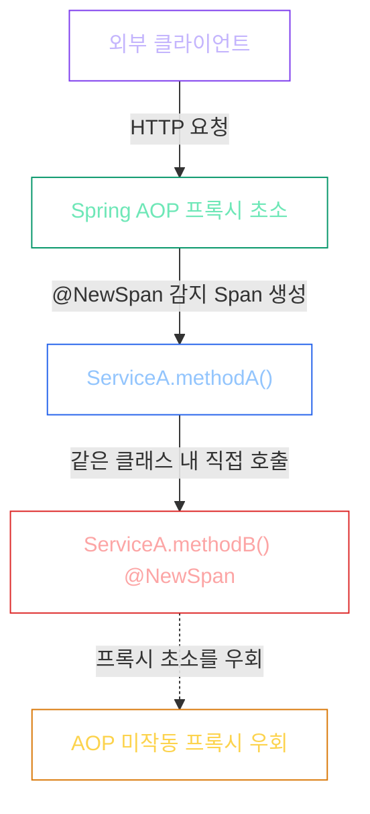
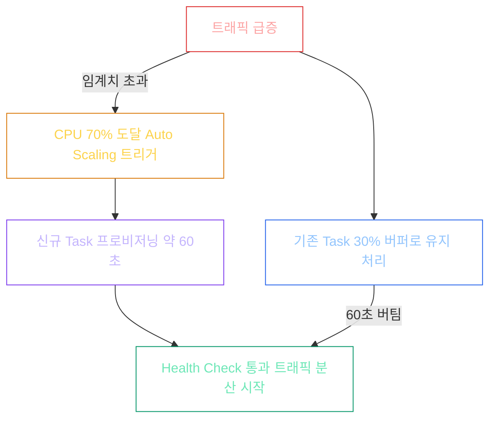

[1부]()에서 OpenTelemetry + ADOT 사이드카 아키텍처를 확정했다. 이제 Spring Boot 3에 `@NewSpan` 어노테이션으로 추적을 붙이는 단계였다. 예상보다 단순해 보였다.

하지만 코드를 짜기 시작하자마자 AOP가 작동을 안 했다. 분명히 어노테이션을 달았는데 X-Ray 화면에 아무것도 잡히지 않았다. 그다음엔 어노테이션은 잡히는데 SpanAspect 빈이 없다는 에러가 떴다. 겨우 해결했더니 이번엔 배포 직후 로그를 잘못 읽어서 멀쩡한 코드를 직접 지웠다.

세 번의 함정을 순서대로 기록해둔다.

---

## 함정 1: AOP가 왜 안 먹히는가 — Self-Invocation 안티패턴

처음에는 단순하게 생각했다. `@NewSpan`을 메서드에 붙이면 Spring AOP(관점 지향 프로그래밍)가 그 메서드를 추적해줄 거라고.

*"같은 클래스 안에서 메서드를 부르면 어떻게 되는 것 같아?"*

AI 튜터의 질문에 처음엔 무슨 말인지 감이 안 왔다. 설명을 들으니 이해됐다.

Spring AOP는 프록시(Proxy, 중간 대리인) 객체를 통해서만 작동한다. 외부에서 `service.methodA()`를 호출하면 Spring이 만든 프록시 객체를 먼저 거친다. 프록시가 `@NewSpan`을 감지하고 Span(스팬, 추적 단위)을 생성한 뒤 실제 메서드를 호출한다.

문제는 같은 클래스 안에서 `this.methodB()`를 호출할 때다. 이 경우 프록시를 거치지 않고 실제 객체의 메서드를 직접 부른다. Aspect가 작동할 기회 자체가 없다.

카메라(Aspect)는 문(외부 진입점) 앞에만 설치되어 있다. 방 안에서 방 안 다른 방으로 이동하면 카메라를 지나치지 않는다.

결국 거시적 경계(Controller → Service, Service → Repository)에서는 AOP를 쓰고, 같은 클래스 내부의 세밀한 추적이 필요한 곳은 `Tracer.startScopedSpan()`을 직접 호출하는 수동 코딩(Programmatic Tracing)으로 처리하는 방향으로 정리했다. 두 방식을 섞어 쓰는 것이 실무 표준이다.

---

## 함정 2: SpanAspect는 자동으로 등록되지 않는다

AOP 작동 원리를 이해하고 나서, 이번엔 다른 에러가 떴다. `SpanAspect` 빈을 찾을 수 없다는 내용이었다.

`build.gradle`에 `spring-boot-starter-aop`를 추가했으니 당연히 자동으로 등록될 거라 생각했다. Spring Boot Auto-Configuration(자동 구성)이 알아서 해줄 거라고.

그런데 Spring Boot 3의 Micrometer Tracing에서 `SpanAspect`는 Auto-Configuration 대상이 아니다. 아래 3개 빈을 명시적으로 등록해야 한다.


@Configuration
class TracingConfig(private val tracer: Tracer) {

    @Bean
    fun newSpanParser(): NewSpanParser = NewSpanParser()

    @Bean
    fun methodInvocationProcessor(
        newSpanParser: NewSpanParser,
        spanTagAnnotationHandler: SpanTagAnnotationHandler
    ): MethodInvocationProcessor =
        ImperativeMethodInvocationProcessor(newSpanParser, spanTagAnnotationHandler, tracer)

    @Bean
    fun spanAspect(
        methodInvocationProcessor: MethodInvocationProcessor
    ): SpanAspect = SpanAspect(methodInvocationProcessor)
}


| 빈 | 역할 |
|----|------|
| `NewSpanParser` | 스팬 이름 파싱 |
| `MethodInvocationProcessor` | 메서드 호출 가로채기 처리 |
| `SpanAspect` | 실제 AOP 어드바이스 실행 |

공장(Auto-Configuration)이 모든 부품을 자동 조립해주지는 않는다. `@ConditionalOnClass`로 라이브러리 존재를 감지해 자동 구성하는 항목이 있고, 그렇지 않은 항목이 있다. `SpanAspect`는 후자다.

---

## 함정 3: Graceful Shutdown 로그를 버그로 읽었다

ECS 롤링 업데이트(Rolling Update, 무중단 순차 교체 배포) 직후 이 로그가 출력됐다.


Disconnected from the target VM, address: '127.0.0.1:5005'


배포 직후 이 로그를 보자마자 AOP 설정 코드에 문제가 생겨서 앱이 충돌한 거라고 판단했다. 관련 코드를 삭제했다.

그게 실수였다.

AI 튜터의 설명을 들으니, 이 로그는 ECS 롤링 업데이트 과정에서 구버전 컨테이너가 SIGTERM(종료 신호)을 받아 정상적으로 종료(Graceful Shutdown)되면서 디버거 연결이 끊어졌다는 신호였다. 에러가 아니라 정상 종료였다. 삭제한 코드가 오히려 SpanAspect 작동에 필수적인 코드였다.

배포 시점이라는 문맥을 고려하지 않고 로그 한 줄만 보고 판단한 것이 문제였다. 그리고 더 근본적으로는, AI가 생성한 코드를 내가 직접 읽고 이해하지 못한 상태에서 삭제했다는 것이 진짜 문제였다.

> [!CAUTION]
> AI가 생성한 코드의 책임은 100% 운영자에게 있다. 각 줄의 역할을 설명할 수 없다면, 삭제하거나 배포하기 전에 이해부터 해야 한다. 무비판적인 수용과 무비판적인 삭제, 둘 다 위험하다.

---

## Fire Drill — 사이드카 OOM 시 메인 앱은 살아남는가

설계 단계에서 세운 가설을 직접 검증했다. ADOT 사이드카에 인위적으로 OOM(Out Of Memory, 메모리 초과 강제 종료)을 발생시켰을 때 메인 앱의 생존 여부를 확인했다.

결과는 명확했다. **메인 App 컨테이너는 정상적으로 유저 트래픽을 처리했다.**

사이드카가 죽으면 X-Ray 추적 데이터는 일시적으로 누락된다. 하지만 사용자의 결제/주문 처리는 중단되지 않는다. 이것이 1부에서 사이드카 패턴을 선택한 이유였고, 여기서 직접 검증했다.

---

## ECS Auto Scaling — CPU 70%에서 트리거하는 이유

ECS Auto Scaling(자동 수평 확장) 설정에서 가장 설명하기 까다로운 수치가 있다. **왜 CPU 100%가 아닌 70%에서 스케일 아웃(Scale-Out, 컨테이너 대수 증가)을 트리거하는가.**

CPU가 100%에서 트리거를 걸면, 그 시점 컨테이너는 이미 포화 상태다. 만약 이 순간 결제 프로세스가 진행 중이라면 기존 컨테이너가 결제 트랜잭션을 중단할 수 있다. 새 컨테이너가 투입되어 트래픽을 받기까지 약 1분의 프로비저닝 리드타임(Provisioning Lead Time, 새 컨테이너 준비 시간)이 걸리는데, 이 1분 동안 사용자의 결제가 실패할 수 있다. 그래서 CPU 70%에서 미리 트리거를 걸어 나머지 30%의 여유 버퍼로 그 1분을 버티도록 설계한다.

Scale-In(축소) 쿨다운도 중요하다. 빠르게 설정하면 "트래픽 증가 → 스케일 아웃 → 트래픽 감소 → 스케일 인 → 트래픽 증가"의 Thrashing(컨테이너 진동 현상)이 반복된다. 이를 막기 위해 비대칭으로 설계했다.

| 정책 | 설정값 | 이유 |
|------|--------|------|
| Scale-Out 쿨다운 | 60초 | 트래픽 급증에 빠르게 대응 |
| Scale-In 쿨다운 | 300초 (5분) | Thrashing 방지 |

환경마다 달라지는 값(min/max 컨테이너 수)과 SRE 정책으로 고정하는 값(임계치/쿨다운)은 Terraform 변수로 분리해 모듈 재사용성을 확보했다.


# 환경마다 달라지는 값 (variables.tf)
variable "ecs_min_capacity" { default = 1 }
variable "ecs_max_capacity" { default = 4 }

# SRE 정책으로 고정하는 값 (main.tf)
resource "aws_appautoscaling_policy" "ecs_cpu_policy" {
  target_tracking_scaling_policy_configuration {
    target_value       = 70.0  # CPU 70% 임계치
    scale_out_cooldown = 60    # 스케일 아웃 쿨다운
    scale_in_cooldown  = 300   # 스케일 인 쿨다운
  }
}


---

## 면접관에게 방어할 수 있는 포인트

| 질문 | 핵심 답변 |
|------|-----------|
| "왜 X-Ray SDK 안 쓰고 OTel을?" | Spring Boot Micrometer 추상화로 코드 오염 없이 백엔드 교체 가능 |
| "사이드카가 죽으면 메인 앱은?" | Fault Isolation — 메인 앱은 생존. Fire Drill로 직접 검증 |
| "왜 CPU 70%에서 트리거?" | 1분 프로비저닝 리드타임 버퍼 확보. 결제 트랜잭션 중단 방지 |
| "AOP가 안 먹히면?" | Self-Invocation 안티패턴 의심. 거시 경계는 AOP, 내부 로직은 Programmatic Tracing |
| "SpanAspect 자동 등록 안 되나?" | Spring Boot 3 Micrometer는 3개 빈 수동 등록 필요 |

SRE 관점에서 이번 구현에서 가장 중요하게 가져가는 교훈은 하나다. 모니터링 인프라는 비즈니스 인프라의 장애 전파 경로에서 반드시 분리되어야 한다. ADOT 사이드카가 죽어도 결제는 살아있어야 한다. Fire Drill로 그걸 확인했다.

FinOps 관점에서는 Sampling Rate 50%로 X-Ray 비용을 절반으로 줄였고, Scale-In 쿨다운 5분으로 불필요한 컨테이너 기동/종료 사이클을 줄여 Fargate 과금을 최적화했다.

---

**[1부 링크]** → [ECS Fargate에 OpenTelemetry로 분산 추적 APM 구축하기 — Vendor Lock-in 방어와 사이드카 설계 (1부)]()
