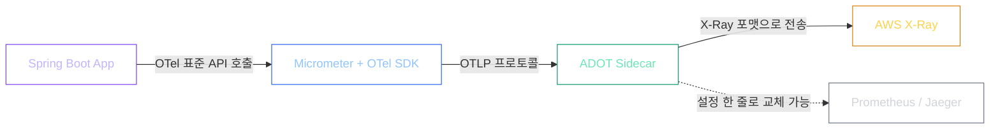
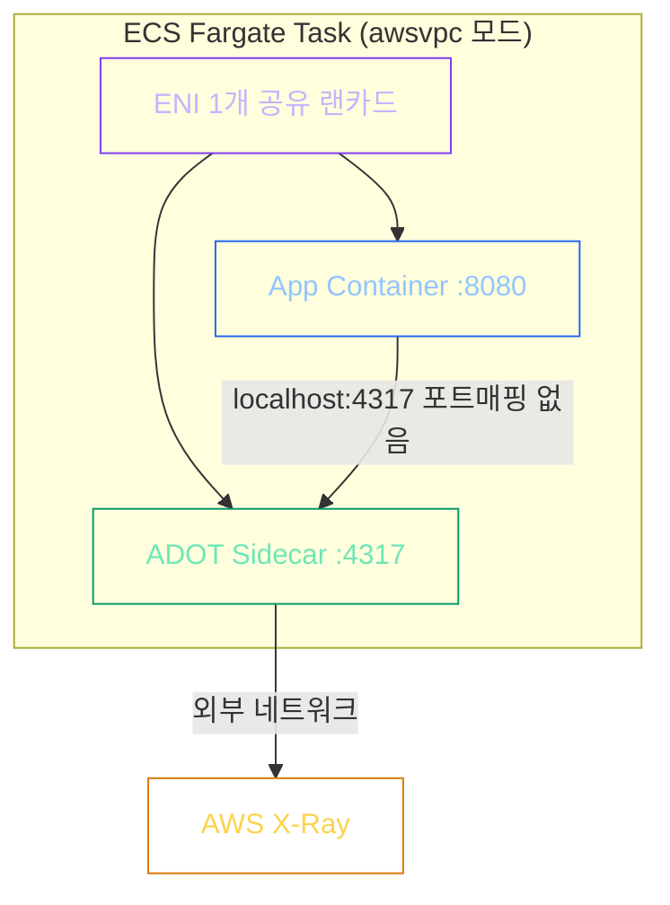
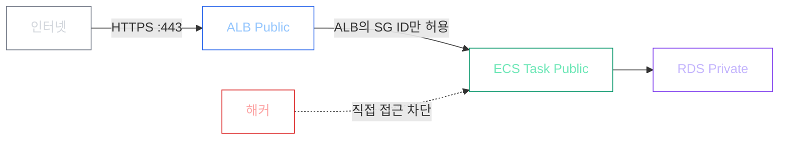

CloudWatch Logs를 열심히 들여다보고 있었다. `/api/order` 요청이 가끔 3초를 넘는다. 로그에는 "요청 들어옴", "요청 완료"만 찍힌다. 그 3초 중 2.5초가 RDS 쿼리인지, 아니면 외부 API 호출이 막힌 건지 — 전혀 알 수 없었다.

그 순간 처음으로 깨달았다. 로그(Log)는 "무슨 일이 일어났는가"를 기록하고, 메트릭(Metric)은 "얼마나 많이"를 측정한다. 하지만 **"누가, 어디서, 얼마나 걸렸는가"** — 이건 둘 다 못 한다. 그게 Distributed Tracing(분산 추적)의 영역이다.

RDS Performance Insights(PI)도 꺼내봤다. 위내시경처럼 DB 내부는 잘 보여줬지만, 그 위에서 일어나는 일 — ALB → ECS → RDS 전체 흐름에서 어느 구간이 병목인지 — 는 보이지 않았다. APM(Application Performance Monitoring, 애플리케이션 성능 모니터링) 없이는 분산 환경의 병목을 절대 짚어낼 수 없다는 걸 인정해야 했다.

---

## AWS X-Ray SDK를 쓰면 되는 거 아닌가?

APM 도구로 가장 먼저 떠오른 건 당연히 AWS X-Ray SDK였다. ECS Fargate 환경이니까, AWS 것을 쓰면 자연스러울 거라 생각했다.

AI 튜터에게 이 방향으로 이야기했더니, 반문이 돌아왔다.

*"X-Ray SDK는 지금 유지보수 모드(Maintenance Mode)야. 신기능은 없고 버그 수정만 하고 있어. 그리고 AWS SDK를 비즈니스 로직 코드에 직접 심으면 어떻게 되지? 나중에 Azure나 GCP로 옮겨야 할 때 그 코드는 어떻게 할 거야?"*

솔직히 처음엔 "지금 당장 AWS만 쓸 건데 뭐가 문제야"라고 생각했다. 그런데 조금 더 생각해보니 문제가 보였다.

AWS X-Ray SDK를 쓰면 비즈니스 로직 코드 안에 AWS 의존성이 직접 심어진다. Spring Boot 코드 곳곳에 AWS 전용 어노테이션과 클라이언트가 들어간다는 뜻이다. 훗날 멀티클라우드(Multi-Cloud, 여러 클라우드를 혼용하는 환경)로 전환하거나 다른 APM 백엔드로 교체할 때 코드 오염(Code Pollution)이 불가피해진다.

그런데 Spring Boot는 이미 Micrometer(마이크로미터)라는 모니터링 추상화 계층을 내장하고 있다. 이걸 활용하면 앱 코드는 OTel 표준 API만 호출하고, 실제 데이터를 어디로 보낼지(X-Ray, Jaeger, Prometheus 등)는 사이드카 설정에서만 결정할 수 있다. 코드는 오염되지 않는다.

이 구조를 이해하고 나서 방향이 바뀌었다. **OpenTelemetry(오픈텔레메트리, 벤더 중립 추적 표준)로 수집하고, ADOT 사이드카가 X-Ray로 전달하는 계층 분리 방식을 선택했다.**

> [!IMPORTANT]
> **Vendor Lock-in(벤더 종속성)**: 특정 플랫폼의 전용 SDK를 코드에 직접 심을 때 발생한다. OpenTelemetry는 이 문제를 해결하기 위해 CNCF(Cloud Native Computing Foundation)가 주도하는 업계 표준으로, 현재 AWS를 포함한 모든 주요 클라우드가 공식 지원한다.

---

## 그러면 ADOT를 앱 컨테이너 안에 같이 넣으면 안 되나?

X-Ray SDK 대신 OpenTelemetry를 쓰기로 했다. 그다음 질문은 "그럼 ADOT 에이전트를 어디에 두냐"였다. 앱 컨테이너 안에 그냥 같이 넣으면 제일 간단하지 않을까?

AI 튜터가 다시 반문했다.

*"ADOT 에이전트가 메모리를 너무 많이 써서 OOM(Out Of Memory)이 나면 어떻게 되지?"*

앱과 에이전트가 같은 컨테이너 안에 있으면, 에이전트 하나가 죽을 때 앱도 함께 죽는다. 모니터링 도구 때문에 서비스가 다운되는 상황이 만들어진다.

그래서 사이드카(Sidecar) 패턴으로 분리하기로 했다. 메인 앱은 비즈니스 로직만, ADOT 사이드카는 모니터링만 전담한다. 사이드카가 죽어도 메인 컨테이너는 죽지 않고 비즈니스 로직을 계속 수행할 수 있다. 이걸 **Fault Isolation(장애 격리)**이라고 한다.

실제로 나중에 사이드카에 인위적으로 OOM을 발생시키는 Fire Drill(장애 격리 검증 실험)을 해봤고, 메인 앱이 살아남는 걸 직접 확인했다. 그 과정은 2부에서 다룬다.

---

## SRE 관점에서 배포 전에 점검했던 것들

설계를 코드로 옮기기 전, 세 가지를 직접 검증했다.

**첫째, 사이드카와 앱이 어떻게 통신하는가.**

처음엔 같은 Task 안에 있어도 서로 다른 컨테이너니까 포트 매핑이 필요할 것이라 생각했다. 그런데 ECS Fargate의 awsvpc 모드는 Task(태스크, ECS 컨테이너 묶음) 전체에 단 하나의 ENI(Elastic Network Interface, 가상 랜카드)를 할당한다. 같은 Task 안의 컨테이너들은 `localhost(127.0.0.1)`를 공유한다는 뜻이다.

포트 매핑 없이 `localhost:4317`만 적으면 사이드카와 통신된다. 공유 랜카드 덕분이다.

**둘째, IAM 역할이 하나로 묶여 있으면 어떤 위험이 있는가.**

ECS에는 두 종류의 IAM Role이 있다. Execution Role은 ECS 에이전트(AWS 인프라)가 ECR에서 이미지를 당기고 로그를 쓰는 권한이고, Task Role은 앱 컨테이너가 실제로 S3, RDS, X-Ray를 호출하는 권한이다. 이 둘을 하나로 합치면, Task Role이 탈취됐을 때 인프라 제어 권한까지 함께 노출된다. Blast Radius(보안 사고 시 피해가 연쇄적으로 퍼지는 범위)를 줄이려면 반드시 분리해야 한다.

**셋째, 트래픽이 많을 때 추적 비율을 얼마로 잡을 것인가.**

초당 1,000개의 요청이 들어올 때 100%를 추적하면 ADOT 사이드카 CPU가 급증하고 X-Ray 데이터 수집 비용도 함께 오른다. "출구 조사(Exit Poll)"처럼 전체를 다 추적하지 않아도 패턴을 파악하는 데는 충분하다. 우리 서비스는 `samplingRate: 0.5`(50%)로 설정했다. 운영 중 비용과 데이터 충분성 사이에서 조율한 수치다.

---

## Fargate를 선택한 FinOps 논리

이 시점에 AI 튜터가 질문을 던졌다. *"Fargate는 EC2보다 비싸다. 왜 쓰는가?"*

EC2 기반 ECS에서 스케일 아웃(Scale-Out, 서버 대수 증가)이 필요하면 새 EC2 인스턴스를 띄워야 한다. OS 커널 초기화가 1~2분 걸린다. Fargate는 AWS가 미리 부팅해둔 Firecracker MicroVM(경량 가상 머신) 풀에서 컨테이너 프로세스만 주입하므로, OS 부팅 단계가 없다. 약 30~60초 안에 신규 태스크가 트래픽을 받을 수 있다.

Fargate의 요금 프리미엄은 OS 패치, AMI(Amazon Machine Image, EC2 커스텀 이미지) 굽기, 새벽 보안 업데이트 같은 **인프라 운영 인건비를 AWS에 아웃소싱하는 비용**이다. ECS Task를 Public 서브넷에 두면서 발생하는 NAT Gateway(네트워크 주소 변환 게이트웨이) 비용도 없앴다. 대신 ALB의 보안 그룹 ID만 허용하는 보안 그룹 체이닝(SG Chaining)으로 직접 접근을 차단해 동등한 보안 수준을 유지했다.

운영 규모가 작을 때는 Fargate가 총 비용(TCO) 기준으로 유리하다는 결론을 냈다.

---

## 설계 결정 요약

| 결정 | 선택 | 포기한 것 | 얻은 것 |
|------|------|-----------|---------|
| X-Ray SDK → OTel | OpenTelemetry + ADOT | AWS 네이티브 간편함 | 벤더 종속성 제거 |
| 모놀리식 에이전트 → 사이드카 | ADOT Sidecar | 단순한 구성 | Fault Isolation |
| 100% 추적 → 부분 추적 | 50% Sampling | 완전한 트레이스 데이터 | CPU·비용 절감 |
| EC2 → Fargate | Fargate | OS 제어권 | 인프라 운영 부담 제거 |
| Private → Public + SG 체이닝 | Public + SG Chaining | 네트워크 격리 단순함 | NAT 비용 제거 |

설계를 실제 코드로 구현하는 과정에서는 예상치 못한 함정이 세 개 기다리고 있었다. AOP가 왜 안 먹히는지, Spring Boot 3에서 SpanAspect를 왜 직접 등록해야 하는지, 그리고 Graceful Shutdown 로그를 버그로 착각해서 멀쩡한 코드를 지운 사건 — 그 이야기는 2부에서 다룬다.

**[2부 링크]** → [ECS Fargate AOP 트러블슈팅 + Auto Scaling SRE 설계 (2부)]()
