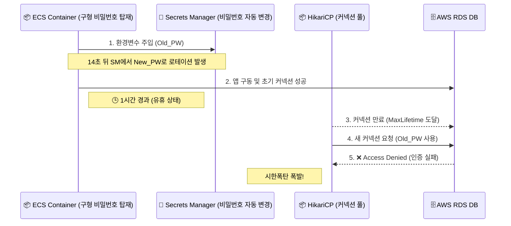

## 1. Context & Issue (배경 및 문제)

기존 실습에서는 DB 비밀번호를 GitHub Actions Secret이나 환경변수로 주입하는 방식을 사용했습니다. 이번에는 한 단계 더 나아가 보안을 강화하고 비밀번호 교체를 자동화해보기 위해 AWS Secrets Manager를 인프라에 도입했습니다.

Terraform으로 인프라를 구성하고 배포 테스트를 진행했을 때, 애플리케이션은 정상적으로 구동되었고 DB 연결도 문제가 없어 보였습니다. 하지만 배포 후 약 1시간 정도가 지났을 때, 갑작스럽게 `Access Denied` 에러가 발생하기 시작했습니다.

트래픽이 급증한 것도, 추가적인 배포가 있었던 것도 아닌데 일정 시간이 지난 후 발생한 문제였습니다.

## 2. Socratic Deep Dive (원인 파악)

에러를 분석하는 과정에서 AI 튜터와 심도 있는 대화를 나누며 근본 원인을 파헤쳤습니다.

- **나의 첫 번째 분석 (오해)**: 처음에는 Secrets Manager에서 생성된 JSON 문자열(`{"username":"root", "password":"..."}`) 전체가 `SPRING_DATASOURCE_PASSWORD` 환경변수에 들어가면, Spring Boot가 똑똑하게 이를 파싱해 줄 것이라고 오해했습니다. 또한 비밀번호가 갱신되어 새 컨테이너가 뜰 때 기존 커넥션 풀은 알아서 정상 종료될 거라 생각했습니다.
- **AI 튜터의 팩트체크**: Spring Boot는 환경변수에 들어간 문자열 그대로를 비밀번호로 취급합니다. 즉, JSON 전체가 통째로 비밀번호로 들어가 DB 인증에 실패하는 현상이 첫 번째 문제였습니다. 더 치명적인 두 번째 문제는 HikariCP 내부 커넥션 생존주기와 ECS 컨테이너 환경변수의 생명주기 불일치였습니다.
- **나의 통찰 (Aha-Moment)**: 로그를 시계열로 분석해 보니 소름 돋는 사실을 발견했습니다. 불과 14초 차이로 로테이션 직전의 '구형 비밀번호'를 주입받은 채 뜬 ECS 태스크가 있었습니다. 이 컨테이너는 당시에는 정상적으로 커넥션을 맺었지만, 약 1시간 뒤 HikariCP의 유휴 커넥션(Idle Connection)이 만료되고 새로운 커넥션을 맺으려 할 때, 자신이 태어날 때 받았던 '구형 비밀번호'로 재연결을 시도하다가 `Access Denied`가 발생한 것입니다.

이 복잡한 Race Condition(경합 조건) 상황을 다이어그램으로 시각화하면 다음과 같습니다.

## 3. Alternatives & Trade-off (의사결정)

이 문제를 해결하기 위해 두 가지 선택지를 고민했습니다.

1. **단기적 조치 (수동 관리)**: Secrets Manager의 자동 로테이션을 끄고 엔지니어가 수동으로 배포 주기에 맞춰 비밀번호를 변경한다.
2. **근본적 조치 (Terraform 및 ECS 권한 정밀 제어)**: Terraform의 `aws_db_instance`에서 `manage_master_user_password = true`를 설정하여 AWS에 라이프사이클을 위임하고, ECS Task Definition에서 `:password::` 식별자를 통해 정확한 값을 주입한다.

**의사결정 근거**: 보안 부채를 남기지 않기 위해 후자를 선택했습니다. 자동 로테이션 활성화 시 Secret당 월 0.4$의 비용이 발생하고 인프라 구성이 다소 복잡해집니다. 하지만 하드코딩된 비밀번호가 탈취될 위험 비용과, 중앙화된 CloudTrail 보안 감사 이점을 고려할 때 이 정도의 트레이드오프(Trade-off)는 SRE 관점에서 매우 훌륭한 투자라고 판단했습니다.

아래는 이를 해결하기 위해 수정한 Terraform 코드의 일부입니다.


container_definitions = jsonencode([
  {
    name = "cover-challenge-app"
    secrets = [
      {
        name      = "SPRING_DATASOURCE_PASSWORD"
        # [핵심] JSON 형태의 금고에서 'password' 키값만 핀셋으로 뽑아옵니다.
        valueFrom = "${var.db_secret_arn}:password::"
      }
    ]
  }
])


## 4. Resolution & Lesson (결과 및 면접 방어)

결과적으로 ECS 컨테이너는 정확하게 비밀번호 값만을 주입받게 되었고, 배포 스크립트에 Secrets Manager 로테이션 주기와 ECS 태스크 교체 주기를 동기화하는 로직을 추가하여 시한폭탄 이슈를 완전히 해결했습니다.

**[면접 방어 및 SRE 인사이트]**
이번 트러블슈팅을 통해 "환경변수는 컨테이너 기동 시점에 스냅샷처럼 고정된다"는 불변의 원칙을 뼈저리게 배웠습니다. 애플리케이션 내부의 생명주기(HikariCP MaxLifetime)와 인프라의 생명주기(Secrets Manager Rotation)가 어긋날 때 시스템이 어떻게 무너지는지 확인했습니다. 
장애가 났을 때 단순히 '비밀번호가 틀렸구나'로 넘기지 않고, '왜 1시간 뒤에 틀렸을까?'를 집요하게 파고들어 분산 시스템의 Race Condition(경합 조건)을 규명한 것이 가장 큰 수확이었습니다.
