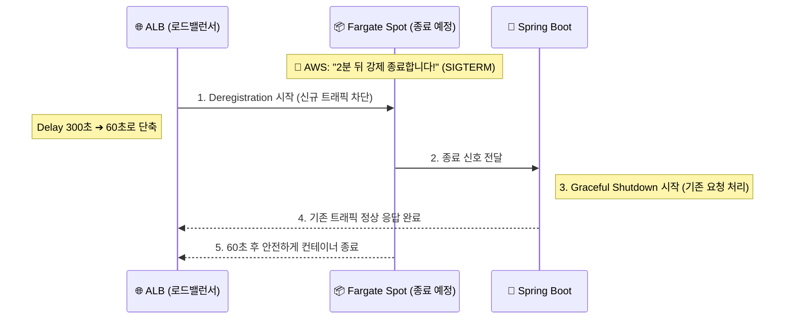

## 1. Context & Issue (배경 및 문제)

인프라 실습 중 ECS 클러스터의 운영 비용을 절감(FinOps)할 수 있는 방법을 고민하게 되었습니다. AWS 인프라 비용의 대부분이 컴퓨팅 자원에서 발생하기 때문에, 온디맨드 대비 저렴한 **Fargate Spot** 인스턴스의 도입을 고려했습니다.

하지만 Spot 인스턴스에는 치명적인 제약이 있습니다. AWS가 자원이 필요해지면 불과 **2분(120초)**의 사전 통보 후 컨테이너를 강제로 종료해 버린다는 점입니다. 무작정 100% Spot으로만 구성하면 AWS 자원 고갈 시 서비스 전체가 다운될 위험이 컸습니다.

비용 절감과 서비스 안정성(Resilience)이라는 두 마리 토끼를 어떻게 잡을 것인가가 핵심 과제였습니다.

## 2. Alternatives & Trade-off (의사결정 1: 하이브리드 아키텍처)

Spot 인스턴스 중단 방어를 위해 두 가지 선택지를 고민했습니다.

1. **100% Spot 사용**: 비용은 최대화되지만, 인스턴스 일괄 종료 시 가용성(Availability) 제로가 될 위험.
2. **하이브리드 전략 (Base & Weight)**: 최소한의 생명줄(온디맨드)을 쥐고 가면서 스케일 아웃 자원만 Spot으로 충당.

**의사결정 근거**: 2번을 선택했습니다. ECS Capacity Provider Strategy 설정에서 `Base=1` (온디맨드 1대 상시 보장), `Weight=100` (나머지 스케일 아웃은 Spot) 전략을 채택했습니다. 메인 서버 하나는 안정적인 Fargate 온디맨드로 유지하여 최악의 상황에서도 서비스가 멈추지 않게 하고, 트래픽 증가(ALB)로 인해 증축되는 서버들만 저렴한 Spot으로 배치하는 우아한 타협(Trade-off)이었습니다.

## 3. Socratic Deep Dive (의사결정 2: 무중단 방어)

하이브리드 구성 후, Spot 인스턴스가 2분 통보를 받고 꺼질 때 발생할 수 있는 클라이언트 에러(502 Bad Gateway)를 막기 위해 고민했습니다.

- **나의 첫 번째 분석 (오해)**: Spot 인스턴스가 종료될 때 Auto Scaling이 알아서 새 인스턴스를 띄워주니 자연스럽게 다운타임이 없을 것이라 생각했습니다.
- **AI 튜터의 팩트체크**: 식당이 2분 뒤 철거되는데 로드밸런서(ALB) 매니저가 5분 동안 계속 새 손님을 들여보내는 꼴입니다. ALB의 등록 취소 지연(`Deregistration Delay`) 기본값이 300초(5분)이기 때문입니다.
- **나의 통찰 (Aha-Moment)**: 무중단(Zero-Downtime)을 달성하려면 외부와 내부의 양방향 통제가 필수적임을 깨달았습니다. 문지기(ALB)의 라우팅 유효시간을 줄여 신규 유입을 빨리 끊고, 내부 주방장(Spring Boot)은 기존 요리를 안전하게 마무리하는 설정이 결합되어야 합니다.

## 4. Resolution & Lesson (결과 및 면접 방어)

결론적으로 다음과 같은 조치를 통해 Spot 인스턴스 강제 종료 시에도 에러율 0%의 무중단 배포를 달성했습니다.
1. ALB Target Group의 `Deregistration Delay`를 60초로 단축
2. Spring Boot 설정에 `server.shutdown=graceful` 추가

**[면접 방어 및 SRE 인사이트]**
이번 실습을 통해 클라우드 환경에서 "서버는 언제든 죽을 수 있다(Design for Failure)"는 대원칙을 몸소 체험했습니다. 값싼 인스턴스를 도입해 비용을 절감하는 것을 넘어, 서버가 종료되는 순간에도 ALB의 라우팅 계층과 애플리케이션의 프로세스 계층을 조율하여 사용자 경험을 지켜내는 것이 진정한 인프라 엔지니어링임을 배웠습니다.

---
**[인프라 트러블슈팅 시리즈]**
- **1편**: [Terraform State Drift와 ECS 롤백 딜레마 극복기]()
- **2편**: [AWS Secrets Manager 자동 로테이션과 커넥션 풀 생명주기 불일치 트러블슈팅]()
- **3편**: ECS Fargate Spot 비용 최적화와 ALB 무중단 배포 설계 (현재 글)
- **4편**: [Terraform DB 재생성 에러와 Redis 분산 락을 활용한 캐시 스탬피드 방어]()
- **5편**: [Trivy를 활용한 Shift-Left 컨테이너 보안 파이프라인 구축]()
