## 1. Context & Issue (배경 및 문제)

인프라 실습 과정에서 클라우드 비용 최적화(FinOps)를 경험해보기 위해 AWS ECS Fargate Spot을 도입해 보았습니다. Spot 인스턴스는 온디맨드 대비 비용 절감 효과가 컸지만, 자원이 부족해지면 2분(120초)의 사전 통보 후 인스턴스가 종료되는 제약이 있었습니다.

이와 더불어 대규모 트래픽을 가정하여 부하 테스트를 진행하던 중, 캐시 미스(Cache Miss) 발생 순간 다수의 요청이 한꺼번에 DB로 몰리면서 Tomcat 스레드 풀과 DB 커넥션 풀이 동시에 고갈되는 '캐시 스탬피드(Cache Stampede)' 현상을 확인했습니다. 비용 절감 구조 위에서 애플리케이션의 안정성을 어떻게 유지할지가 중요한 과제였습니다.

## 2. Socratic Deep Dive (원인 파악)

- **나의 첫 번째 분석 (오해)**: Spot 인스턴스가 종료될 때 Auto Scaling이 새 인스턴스를 띄워주면 다운타임이 없을 거라 생각했습니다. 또한 캐시 스탬피드는 DB 트랜잭션 락이나, 분산 락의 대기 시간(waitTime)을 1분 정도로 아주 넉넉하게 주면 10만 명을 순차적으로 잘 처리할 거라 믿었습니다.
- **AI 튜터의 팩트체크**: 식당이 2분 뒤 철거되는데 로드밸런서(ALB) 매니저가 5분 동안 계속 새 손님을 들여보내는 꼴입니다. ALB의 등록 취소 지연(Deregistration Delay) 기본값이 300초(5분)이기 때문입니다. 또한 분산 락 대기 시간을 1분으로 잡으면, 200개뿐인 Tomcat 스레드가 락을 기다리느라 1분간 모두 얼어붙습니다. 결국 ALB의 헬스체크(Health Check)조차 응답하지 못해 ALB가 서버를 '사살'해 버립니다.
- **나의 통찰 (Aha-Moment)**: 무중단(Zero-Downtime)을 달성하려면 외부(ALB)에서의 신규 유입을 빨리 끊고(`deregistration_delay=60`), 내부에서는 기존 트래픽을 안전하게 마무리(`graceful shutdown`)하는 양방향 통제가 필수적임을 깨달았습니다. 또한 10만 명이 몰렸을 때 1명에게만 '입장권(락)'을 주어 DB를 지키게 하고, 나머지 99,999명은 락 획득 실패 시 에러를 반납하여 '대기열 화면(Queue)'을 띄워주는 것이 최상의 Fallback UX임을 통찰했습니다.

```mermaid
sequenceDiagram
    participant User as 👥 10만 명의 유저
    participant Redis as ⚡ Redis (Redisson)
    participant Tomcat as 🐱 Tomcat (200 Threads)
    participant DB as 🗄️ RDS DB
    
    User->>Tomcat: 캐시 미스! 10만 건 동시 요청
    Tomcat->>Redis: 1. tryLock(waitTime=0) 시도
    Note right of Redis: 빠른 실패(Fail-fast) 전략!
    Redis-->>Tomcat: 1명만 락 획득 성공 (True)
    Redis-->>Tomcat: 99,999명은 즉시 실패 (False)
    
    rect rgb(20, 50, 20)
        Tomcat->>DB: 2. 락 획득한 1명만 DB 쿼리 실행
        DB-->>Tomcat: 3. 결과 반환 및 캐시 갱신
    end
    
    Note left of Tomcat: 99,999명은 락 대기로 스레드를 낭비하지 않음!
    Tomcat-->>User: 4. 대기열(Fallback) 안내 응답
```

## 3. Alternatives & Trade-off (의사결정)

**1. Spot 인스턴스 중단 방어 (하이브리드 아키텍처)**
- 100% Spot 인스턴스로 구성할 경우 AWS 용량 고갈 시 전체 서비스가 다운되는 리스크가 큽니다.
- **의사결정**: ECS Capacity Provider Strategy에서 `Base=1` (온디맨드 1대 상시 보장), `Weight=100` (나머지 스케일 아웃은 Spot) 전략을 채택했습니다. 최소한의 생명줄(온디맨드)을 쥐고 가면서 최대한의 비용 절감을 이루는 Trade-off입니다.

**2. 분산 락 라이브러리 선택 (Lettuce vs Redisson)**
- Spring Boot의 기본 Lettuce는 락을 얻을 때까지 계속 찔러보는 Spin Lock 방식이라 Redis(t3.micro) CPU에 엄청난 부하를 줍니다.
- **의사결정**: Pub/Sub 구조로 락 해제 이벤트를 구독하는 **Redisson**을 채택했습니다. 비즈니스 로직과 동시성 제어가 섞이는 것을 막기 위해 AOP(@Aspect) 프록시를 도입했고, 트랜잭션 경계가 락보다 늦게 끝나 발생하는 Race Condition을 방지하기 위해 `REQUIRES_NEW`로 트랜잭션을 물리적으로 분리했습니다.

## 4. Resolution & Lesson (결과 및 면접 방어)

ALB `deregistration_delay`를 60초로 튜닝하고 Spring Boot의 `server.shutdown=graceful`을 설정하여 Fargate Spot 중단 통보 시에도 502 에러 없이 무중단 배포 및 확장을 달성했습니다. 더불어 Redisson 분산 락을 통해 대규모 캐시 스탬피드를 방어하고 DB를 안전하게 보호할 수 있었습니다.

**[면접 방어 및 SRE 인사이트]**
"아무리 뛰어난 분산 락이라도 대기 시간(waitTime)을 길게 잡으면, 오히려 서버의 스레드 풀을 말라 죽이는 단일 장애점(SPOF)이 될 수 있다"는 사실을 배웠습니다. 빠른 실패(Fail-fast)를 통해 자원을 아끼고, 비즈니스 로직이 아닌 시스템 아키텍처(대기열 UX 등)로 트래픽을 분산시키는 것이 SRE의 진정한 설계 역량임을 깨달았습니다.
