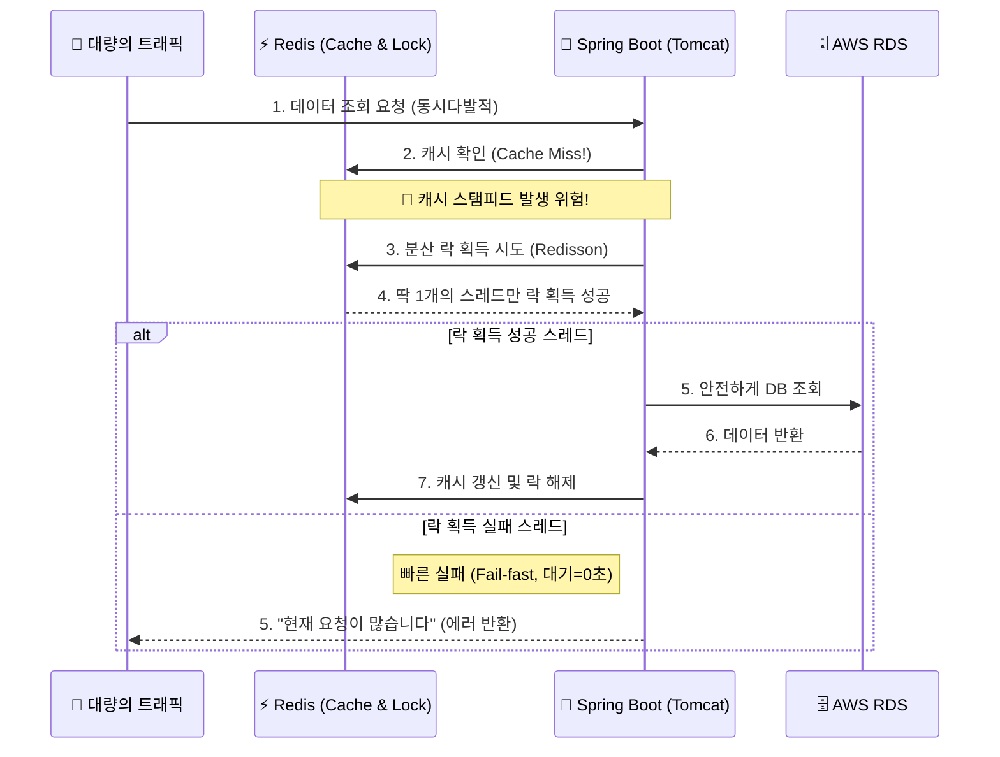

## 1. Context & Issue (배경 및 문제)

인프라 실습 중 DB 비밀번호 관리를 고도화하기 위해 Secrets Manager와 KMS를 도입하고, Terraform을 통해 DB 리소스를 다시 생성(`terraform apply`)하는 작업을 진행하고 있었습니다.

이 과정에서 새 DB 엔드포인트와 비밀번호가 생성되었지만, ECS에 배포되어 있던 기존 컨테이너들은 여전히 **과거의 DB 접속 정보**를 들고 있는 상태였습니다. 그 결과 애플리케이션 로그에 "DB 연결 실패(Connection Refused/Access Denied)" 에러가 쏟아지기 시작했습니다.

단순히 DB 연결이 끊긴 것에서 끝났다면 ECS 태스크를 재시작하는 것으로 해결되었겠지만, 진짜 문제는 이 단절된 시간 동안 발생한 **'캐시 스탬피드(Cache Stampede)'** 현상이었습니다.

## 2. Socratic Deep Dive (원인 파악)

DB 연결이 실패하자, 평소라면 DB에서 데이터를 가져와 Redis 캐시에 저장해야 할 로직들이 모조리 실패하며 캐시 미스(Cache Miss)가 대량으로 발생했습니다.

- **나의 첫 번째 분석 (오해)**: "DB가 죽었으니 당연히 조회가 안 되겠지. DB만 다시 연결되면 정상으로 돌아올 거야."라고 단순하게 생각했습니다.
- **AI 튜터의 팩트체크**: DB를 복구하더라도, 한 번에 밀려든 10만 개의 요청이 텅 빈 캐시를 보고 동시에 DB로 달려가면(Cache Stampede) 복구되자마자 다시 DB가 뻗어버리는 악순환이 발생합니다.
- **나의 통찰 (Aha-Moment)**: 캐시가 비어있을 때 수많은 스레드가 동시에 DB에 접근하려 하면 Tomcat의 스레드 풀과 DB 커넥션 풀이 동시에 고갈된다는 것을 깨달았습니다. 문이 부서지며 몰려드는 인파를 막기 위해 **단 한 명만 DB에 접근하게 통제하는 '기도 형님(락)'**이 필요했습니다.

## 3. Alternatives & Trade-off (의사결정)

캐시 스탬피드를 막기 위해 락(Lock)을 구현해야 했습니다.

1. **Java `synchronized` / `ReentrantLock`**: 구현은 쉽지만 다중 컨테이너(Scale-out) 환경에서는 서버 간 통제가 불가능함.
2. **Redis Lettuce (Spin Lock)**: 락을 얻을 때까지 계속 Redis를 찌르므로(Polling) Redis 자체에 엄청난 부하를 줌.
3. **Redis Redisson (Pub/Sub)**: 락이 해제될 때 알림을 주므로 부하가 적음.

**의사결정 근거**: 다중 컨테이너 환경에서 Redis 부하를 최소화하기 위해 **Redisson**을 선택했습니다. 특히 여기서 핵심은 분산 락의 **대기 시간(`waitTime`)을 0초로 설정**한 것입니다. 락을 얻지 못하면 1초도 대기하지 않고 즉각 실패(Fail-fast)하게 만들어, 서버의 스레드가 락을 기다리느라 고갈되는 2차 장애를 원천 차단했습니다.

## 4. Resolution & Lesson (결과 및 면접 방어)

Redisson 분산 락을 `waitTime=0`으로 적용한 결과, DB 연결 단절 후 복구되는 시점에 쏟아진 트래픽 트러블을 안정적으로 방어할 수 있었습니다. DB에는 단 하나의 쿼리만 안전하게 도달했고, 나머지 요청은 서버 자원을 낭비하지 않고 즉각 튕겨냈습니다.

**[면접 방어 및 SRE 인사이트]**
"아무리 뛰어난 분산 락이라도 대기 시간(waitTime)을 길게 잡으면, 오히려 서버의 스레드 풀을 말라 죽이는 단일 장애점(SPOF)이 될 수 있다"는 사실을 배웠습니다. 빠른 실패(Fail-fast)를 통해 자원을 아끼고, 비즈니스 로직이 아닌 시스템 아키텍처로 트래픽을 분산시키는 것이 SRE의 진정한 설계 역량임을 깨달았습니다.

---
**[인프라 트러블슈팅 시리즈]**
- **1편**: [Terraform State Drift와 ECS 롤백 딜레마 극복기]()
- **2편**: [AWS Secrets Manager 자동 로테이션과 커넥션 풀 생명주기 불일치 트러블슈팅]()
- **3편**: [ECS Fargate Spot 비용 최적화와 ALB 무중단 배포 설계]()
- **4편**: Terraform DB 재생성 에러와 Redis 분산 락을 활용한 캐시 스탬피드 방어 (현재 글)
- **5편**: [Trivy를 활용한 Shift-Left 컨테이너 보안 파이프라인 구축]()
