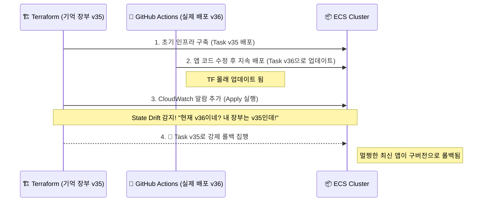

## 1. Context & Issue (배경 및 문제)

인프라 실습 중, 서비스 모니터링을 위해 CloudWatch 5xx 에러 알람을 추가하기로 했습니다. 인프라는 Terraform으로 관리하고 있었기에 `main.tf`에 알람 리소스를 추가하고 `terraform apply`를 실행했습니다.

그런데 예상치 못한 문제가 발생했습니다. 알람만 추가될 줄 알았던 Terraform이, 현재 정상적으로 구동 중이던 최신 애플리케이션 컨테이너들을 과거 버전으로 롤백해 버린 것입니다. 인프라를 코드로 안전하게 관리하려 도입한 Terraform이 오히려 배포된 서비스를 과거 상태로 되돌리는 원인이 되었습니다.

## 2. Socratic Deep Dive (원인 파악)

- **나의 첫 번째 분석 (오해)**: Terraform으로 알람 리소스만 '추가'했으니, 기존에 띄워져 있던 ECS 서비스나 애플리케이션 버전에는 아무런 영향이 없을 것이라 확신했습니다.
- **AI 튜터의 팩트체크**: "테라폼은 기억 상실증 환자입니다!" 그동안 GitHub Actions가 최신 애플리케이션 코드를 36번이나 몰래 배포(Task Definition 갱신)했지만, Terraform의 상태 파일(State) 장부에는 며칠 전에 기록된 '35번 버전'만이 진실로 남아 있었습니다.
- **나의 통찰 (Aha-Moment)**: 당시 상황을 제 언어로 정리해보면 이렇습니다. *"GitHub Actions로 배포되는 ECS의 버전이 Terraform tfstate 장부에 있는 버전보다 높았습니다. Terraform은 '어? 내가 알던 것과 버전이 다른데?' 하고 강제 롤백을 집행했고, 그로 인해 배포가 실패하며 ECS 내부에서는 무한 롤백(Deployment Hang) 루프에 빠진 것입니다."* 즉, 멱등성을 지키려는 Terraform의 원칙(State Drift 보정)이 오히려 장애를 유발하고 있었습니다.

## 3. Alternatives & Trade-off (의사결정)

State Drift를 해결하기 위해 CI/CD 파이프라인의 책임 소재를 분리해야 했습니다.

1. **Terraform에서 모든 것을 관리**: GitHub Actions 배포 시마다 Terraform State를 업데이트하도록 연동. 
   - *단점*: 파이프라인이 극도로 복잡해지고 배포 속도가 느려집니다.
2. **권한의 분리 (Separation of Concerns)**: Terraform은 뼈대(클러스터, 네트워크)만 만들고, 알맹이(Task Definition) 갱신은 GitHub Actions에 완전히 위임한다.

**의사결정 근거**: SRE 업계 표준인 후자를 선택했습니다. Terraform 코드 내에 `lifecycle { ignore_changes = [task_definition] }` 속성을 추가하여, 애플리케이션 버전이 밖에서 변하더라도 Terraform이 간섭하지 않도록 설정했습니다. 


resource "aws_ecs_service" "app" {
  name            = "cover-challenge-service"
  cluster         = aws_ecs_cluster.main.id
  task_definition = aws_ecs_task_definition.app.arn
  
  # ... (생략) ...

  # [핵심] Task Definition이 외부(GitHub Actions)에서 바뀌어도 Terraform이 무시함
  lifecycle {
    ignore_changes = [
      desired_count,
      task_definition
    ]
  }
}


이 설정의 **Trade-off**는 명확합니다. 향후 Terraform 코드로 컨테이너 메모리를 올리더라도 `ignore_changes` 때문에 바로 반영되지 않는 단점이 생깁니다. 하지만, 인프라 코드 수정 시마다 프로덕션이 롤백되는 장애를 겪는 것보다는 관리 포인트를 분리하는 것이 훨씬 더 안전하고 예측 가능한 운영 방식입니다.

## 4. Resolution & Lesson (결과 및 면접 방어)

`ignore_changes` 적용 후, Terraform으로 네트워크나 알람 등 주변 인프라를 자유롭게 수정하고 Apply 해도 더 이상 ECS 컨테이너 버전이 뒤틀리는 롤백 현상이 발생하지 않았습니다.

**[면접 방어 및 DevOps 인사이트]**
"IaC 도구는 만능이 아니다"라는 교훈을 얻었습니다. Terraform은 인프라 프로비저닝에 강점이 있고, GitHub Actions(또는 ArgoCD)는 지속적 배포에 강점이 있습니다. 하나의 도구로 모든 것을 통제하려 하기보다, 도구별 장점을 살려 책임을 명확히 분리(Decoupling)하는 것이 진정한 DevOps 엔지니어의 설계 역량임을 깨달았습니다.

---
**[인프라 트러블슈팅 시리즈]**
- **1편**: Terraform State Drift와 ECS 롤백 딜레마 극복기 (현재 글)
- **2편**: [AWS Secrets Manager 자동 로테이션과 커넥션 풀 생명주기 불일치 트러블슈팅]()
- **3편**: [ECS Fargate Spot 비용 최적화와 ALB 무중단 배포 설계]()
- **4편**: [Terraform DB 재생성 에러와 Redis 분산 락을 활용한 캐시 스탬피드 방어]()
- **5편**: [Trivy를 활용한 Shift-Left 컨테이너 보안 파이프라인 구축]()
