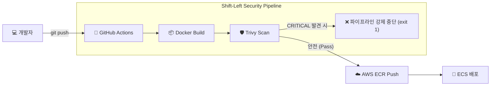

## 1. Context & Issue (배경 및 문제)

기본적인 인프라 배포 자동화 실습을 마친 후, CI/CD 파이프라인에 보안 요소를 추가해보기로 했습니다. 컨테이너 기반(ECS Fargate) 서비스의 특성상 애플리케이션 코드가 안전해도 기반이 되는 Docker 베이스 이미지에 취약점이 있다면 문제가 될 수 있다는 점을 알게 되었습니다.

이를 방어하기 위해 컨테이너 이미지 스캐너인 **Trivy**를 도입해 보았습니다. 하지만 Trivy를 배포 파이프라인의 어느 단계에 배치해야 효과적인지 고민이 필요했습니다.

## 2. Socratic Deep Dive (원인 파악)

- **나의 첫 번째 분석 (오해)**: 처음에는 이미지가 AWS ECR에 푸시된 후에 스캔을 돌리면 충분할 것이라고 생각했습니다. 또한 애플리케이션 코드만 잘 작성하면 구형 베이스 이미지를 써도 안전할 것이라 막연히 오해했습니다.
- **AI 튜터의 팩트체크**: '은행 금고' 비유를 통해, 아무리 금고(애플리케이션)가 튼튼해도 바닥(베이스 이미지)이 부실하면 뚫릴 수 있음을 알게 되었습니다. 또한 위험 요소는 원격 저장소에 올라가기 전(Shift-Left)에 막아야 한다는 점을 팩트체크 받았습니다.
- **나의 통찰 (Aha-Moment)**: ECR에 푸시된 후 스캔하는 방식은 뒤늦은 조치임을 이해했습니다. 빌드 직후, ECR 푸시 이전에 스캔을 수행하여 심각도(HIGH/CRITICAL)가 높은 취약점이 발견되면 파이프라인을 실패(`exit-code 1`)하게 만듦으로써, 결함 있는 이미지가 아예 올라가지 못하게 차단하는 **Shift-Left 접근법**의 실무적 목적을 깨달았습니다.

## 3. Alternatives & Trade-off (의사결정)

Shift-Left 파이프라인을 구축한 후 한 가지 딜레마에 부딪혔습니다. 비즈니스 부서에서 긴급 핫픽스를 요청했는데, Trivy가 특정 취약점 때문에 배포 파이프라인을 꽉 막고 있는 상황입니다.

1. **스캐너 무력화**: 긴급 배포를 위해 임시로 Trivy 스캔 스텝 자체를 주석 처리하거나 `exit-code 0`으로 바꿔 배포를 강행한다.
2. **세밀한 예외 처리 (`.trivyignore`)**: 스캐너는 켜두되, 현재 대응 불가능하거나 오탐지인 특정 CVE 번호만 예외 명단에 등록해 우회한다.

**의사결정 근거**: 보안 인프라 전체의 전원을 끄는 1번 방식은 치명적입니다. 대신 특정 CVE만 `.trivyignore`에 명시하는 2번 방식을 선택했습니다. 이 방식은 보안 부채(Security Debt)를 코드로 시각화하면서도 비즈니스의 속도를 저해하지 않는 SRE의 우아한 타협(Trade-off)입니다.

이후, 컨테이너 내부에 산재해 있던 30여 개의 의존성 CVE들을 개별 조작하는 대신, 프레임워크(Spring Boot) 버전을 메이저 업데이트하여 한 방에 해결하는 정석적인 방법도 실천했습니다.

## 4. Resolution & Lesson (결과 및 면접 방어)

현재 우리의 CI/CD 파이프라인은 Docker 빌드 직후 로컬 환경에서 즉각적으로 취약점을 검사하며, 위험한 이미지는 ECR 문턱조차 넘지 못합니다. 

**[면접 방어 및 DevSecOps 인사이트]**
가장 훌륭한 보안은 애플리케이션 개발 초기 단계(왼쪽)로 보안 책임을 앞당기는 것(Shift-Left)임을 입증했습니다. 
보안과 비즈니스 속도가 충돌할 때, 스캐너를 끄는 식별 불가능한 타협이 아니라 `.trivyignore`라는 '추적 가능한 부채'로 관리함으로써 엔지니어링의 본질인 유연성을 잃지 않는 법을 배웠습니다.
