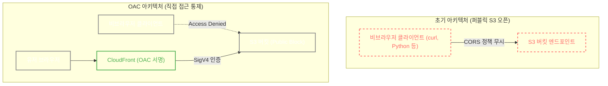

### [Real-World Anchor] 방패를 우회하는 잠재적 직접 접근 리스크
클라우드 아키텍처에서 WAF(웹 방화벽)를 앞단에 세워두더라도, 원본 서버(Origin)나 저장소(S3)의 엔드포인트가 공개되어 있다면 WAF를 우회하는 직접 접근이 가능해집니다. 만약 공개된 객체에 봇이나 악의적인 스크립트를 통한 대량의 요청과 데이터 전송이 발생할 경우, 예상치 못한 클라우드 비용(FinOps 리스크)이 발생할 수 있는 잠재적인 취약점이 됩니다.

### [Context & Issue] 내 시스템의 위험 평가: 프론트엔드 S3는 열어둬도 괜찮을까?
이번 프로젝트에서 프론트엔드를 S3로 분리하여 정적 웹 호스팅을 구축했습니다. 
초기에는 *“어차피 백엔드 앞단에 WAF가 있고, 프론트엔드는 정적 파일뿐이니까 S3는 Public(퍼블릭)으로 열어놔도 되지 않나?”* 라고 가정했습니다. 하지만 이 구조는 앞서 언급한 '직접 접근 리스크'를 가지고 있었습니다. CloudFront를 통해 정상적으로 들어오는 트래픽이 아니더라도, 누구나 S3 엔드포인트 URL을 알아내어 직접 HTTP 요청을 보낼 수 있는 상태였기 때문입니다.

### [Socratic Deep Dive] 원인 파악: CORS 제어만으로는 충분하지 않다

이 문제를 인지한 후, 처음에는 HTTP 헤더 검사 방식인 CORS 설정을 통해 접근을 제어하려 했습니다.

- **초기 판단의 한계**: "해커나 봇이 S3로 직접 들어오는 것은 CORS(Cross-Origin Resource Sharing) 설정으로 CloudFront 도메인만 허용하도록 막으면 되지 않을까?"라고 생각했습니다.
- **아키텍처 재검토**: CORS는 **웹 브라우저**가 준수하는 Cross-Origin 요청 제어 메커니즘입니다. 따라서 브라우저를 거치지 않고 터미널에서 `curl`이나 Python 스크립트 같은 비브라우저 클라이언트를 사용해 요청을 보낸다면 CORS 정책을 강제받지 않습니다. 즉, CORS는 S3에 대한 직접적인 접근 자체를 차단하는 근본적인 통제 수단이 될 수 없음을 깨달았습니다.

### [Alternatives & Trade-off] 설계 및 의사결정: Public Access Block과 OAC
S3를 퍼블릭으로 열어두면 인프라 구현이 직관적이고 매우 쉽습니다. 하지만 그 편의성에 대한 Trade-off로 잠재적인 트래픽 비용 증가 리스크를 짊어져야 합니다.

따라서 S3 엔드포인트를 통한 직접 접근을 차단하기 위해 세 가지 설정을 조합했습니다.
1. **S3 Public Access Block**: `block_public_acls`, `block_public_policy` 등 4가지 옵션을 모두 활성화하여 버킷이 퍼블릭으로 노출되는 것을 방지했습니다.
2. **OAC (Origin Access Control)**: CloudFront가 S3 Origin에 접근할 때 사용할 수 있도록 보안이 강화된 SigV4 서명 인증 방식을 도입했습니다.
3. **Bucket Policy**: S3 버킷 정책에 특정 CloudFront Distribution(배포) ARN이 OAC를 통해 들어올 때만 `s3:GetObject` 권한을 허용하도록 구성했습니다.

### [Resolution & Lesson] 검증 결과
테라폼 코드를 통해 위 세 가지 설정을 모두 인프라에 반영했습니다. 

설정 완료 후, 브라우저나 `curl` 명령어를 통해 S3 엔드포인트 URL로 직접 접속을 시도해 본 결과 예상대로 `Access Denied`가 반환됨을 확인했습니다. 반면, CloudFront 도메인을 통해서는 프론트엔드 화면이 정상적으로 렌더링되었습니다.

단순히 프론트엔드를 호스팅하는 S3 버킷이라도, 시스템의 의도된 경로(CloudFront)를 벗어난 접근 경로가 열려 있다면 잠재적인 리스크가 될 수 있음을 배웠습니다. 접근 통제는 브라우저 정책(CORS)이 아닌 인프라 레벨(Public Block + Policy)에서 단단하게 구성해야 한다는 중요한 레슨을 얻었습니다.
