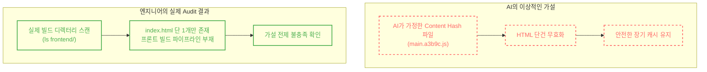

### [Real-World Anchor] AI 시대 엔지니어의 진짜 역할
AI 에이전트가 인프라 코드를 생성하고 아키텍처를 제안하는 시대입니다. 하지만 AI가 제안한 완벽해 보이는 최적화 이론을 시스템의 실제 상태(Ground Truth) 확인 없이 맹목적으로 수용한다면, 애플리케이션의 현실과 인프라 설정이 어긋나는 아키텍처 불일치(Mismatch)가 발생합니다.

### [Context & Issue] 최초 가설: 전체 무효화(/*)와 Origin 부하 리스크
우리 프로젝트는 정적 파일을 S3에 올리고 CloudFront로 배포하는 CI/CD(GitHub Actions)를 구축했습니다. 초기 스크립트는 배포 시 `aws cloudfront create-invalidation --paths "/*"` 명령어로 전체 캐시를 무효화하도록 설정되어 있었습니다.

AI 에이전트는 이를 보고 **대규모 캐시 무효화에 따른 Origin 부하 증가 가능성**을 경고했습니다. 캐시가 일제히 제거된 이후 인기 객체에 대한 요청이 집중되면 캐시 미스가 증가하고, 특정 트래픽 패턴에서는 Cache Stampede와 유사한 오리진 부하가 발생할 수 있다는 판단이었습니다.

AI는 **Content Hash가 적용된 프론트엔드 빌드 환경을 전제로**, Cache Busting 전략을 제안했습니다. 
1. 진입점인 `/index.html` 단 1건만 무효화한다.
2. 나머지 JS/CSS 정적 에셋에는 `max-age=31536000, immutable` 헤더를 부여하여 장기 캐시를 적용한다.

### [Socratic Deep Dive] 실제 Audit: 가설의 전제 조건 검증

AI의 제안은 프론트엔드 빌드 도구(Webpack, Vite 등)가 내용물 기반의 **Content Hash**를 파일명에 부여한다는 전제하에 성립합니다. (예: `main.a3b9c.js`) 내용이 바뀌면 파일명 자체가 달라지기 때문에, 해당 정적 에셋에 대해서는 별도의 캐시 무효화가 필요하지 않다는 논리입니다.

하지만 저는 코드를 즉시 변경(Apply)하는 대신, 현재 프로젝트의 실제 상태를 감찰(Audit)했습니다.

실제 터미널 명령어로 빌드 디렉터리를 스캔한 결과, 프론트엔드 애플리케이션은 아직 구성되지 않았고, 인프라 테스트용 `index.html` 단 하나의 파일만 존재했습니다. 즉, Content Hash를 생성할 빌드 환경 자체가 없었습니다.

### [Alternatives & Trade-off] 가설 폐기와 의사결정 보류
만약 AI의 말만 듣고 해싱(Hashing)이 없는 현재 상태에서 HTML만 무효화하고 Cache-Control 메타데이터를 장기 캐시로 강제했다면 어떻게 되었을까요? 

추후 JS 파일이 추가되고 내용이 변경되더라도 파일명은 그대로 유지되므로, 사용자들은 낡은(Stale) 캐시를 계속 제공받게 됩니다. 리스크를 감소시키려다 오히려 **변경된 애플리케이션 코드가 사용자에게 즉시 반영되지 않는 stale cache 문제를 만들 수 있었습니다.**

### [Resolution & Lesson] 검증 결과
결과적으로 저는 AI가 제안한 Cache-Control 메타데이터 주입 및 인프라 최적화를 전면 **보류(Trade-off)**하기로 결정했습니다. 인프라 코드는 일체 수정하지 않고, 향후 프론트엔드 빌드 파이프라인이 도입되는 시점에 인프라 최적화를 동기화하기로 했습니다.

저는 AI의 제안을 무작정 거부한 것이 아니라, **그 제안이 성립하기 위한 전제조건을 실제 시스템에서 검증한 뒤 적용 시점을 판단했습니다.** 

이번 경험을 통해 "인프라 최적화 전략은 애플리케이션의 실제 동작 특성과 결합될 때만 유효하다"는 사실을 확인했습니다. AI가 아무리 훌륭한 인프라 코드를 제안하더라도, 실제 시스템의 Ground Truth를 확인하고 제안의 전제조건을 검증한 뒤 적용 여부와 시점을 결정하는 것은 엔지니어의 중요한 책임이라는 사실을 다시 한번 확인했습니다.
