### [Real-World Anchor] CloudFront 외의 직접 접근 통제
웹 아키텍처에 CloudFront(CDN)나 글로벌 WAF를 도입할 때, 내부 로드밸런서(ALB)로 향하는 트래픽을 CloudFront의 IP 대역으로만 제한하는 것은 중요한 접근 통제 수단입니다. 방어막을 거치지 않은 비정상적인 직접 접근 리스크를 줄이기 위해, ALB의 보안 그룹(Security Group)에 AWS가 공식 제공하는 `CloudFront Managed Prefix List`를 인바운드 규칙으로 적용하는 것이 일반적입니다.

### [Context & Issue] 내 시스템의 위험 평가: 60개 룰 할당량(Quota)의 벽
우리 프로젝트에서도 악의적 요청이나 불필요한 트래픽이 서울 리전(ALB)까지 도달하기 전에 엣지 단계(CloudFront)에서 미리 차단하여 비용 및 부하 리스크를 줄이는 것을 목표로 했습니다. 

처음에는 일반적인 웹 서비스 환경을 고려하여, **80포트(HTTP)와 443포트(HTTPS)** 두 곳 모두에 Prefix List를 연결하는 테라폼 코드를 작성했습니다.


# [초기 문제의 코드]
ingress {
  from_port       = 80
  to_port         = 80
  protocol        = "tcp"
  prefix_list_ids = [data.aws_ec2_managed_prefix_list.cloudfront.id]
}
ingress {
  from_port       = 443
  to_port         = 443
  protocol        = "tcp"
  prefix_list_ids = [data.aws_ec2_managed_prefix_list.cloudfront.id]
}


하지만 `terraform apply`를 실행하자마자 다음과 같은 에러가 발생했습니다.
`RulesPerSecurityGroupLimitExceeded: The maximum number of rules per security group has been reached.` 
(해석: 보안 그룹 당 최대 규칙 수 할당량에 도달했습니다.)

### [Socratic Deep Dive] 원인 파악: Prefix List의 Rule Weight와 MaxEntries

분명 코드상으로는 인바운드 규칙 2개를 추가했을 뿐인데, 왜 할당량 초과 에러가 발생했을까요?

```mermaid
flowchart TD
    %% 다크모드 호환 설정
    classDef default fill:none,stroke:#888,stroke-width:2px,color:#fff;
    classDef highlight fill:none,stroke:#f66,stroke-width:2px,color:#f66,stroke-dasharray: 5 5;
    classDef secure fill:none,stroke:#4caf50,stroke-width:2px,color:#4caf50;

    subgraph "초기 설계 (Quota 초과 💥)"
        A1["CloudFront Prefix List<br>(MaxEntries: 55)"] -->|"80 포트 (Weight 55 차지)"| B1["ALB 보안 그룹"]
        A1 -->|"443 포트 (Weight 55 차지)"| B1
        B1 -->|"총 110개 > 기본 Quota(60)"| C1[Apply 실패]
    end

    subgraph "최종 설계 (아키텍처 최적화 🔒)"
        A2["CloudFront Prefix List<br>(MaxEntries: 55)"] -->|"443 포트만 연결 (Weight 55 차지)"| B2["ALB 보안 그룹"]
        B2 -->|"총 55개 <= 기본 Quota(60)"| C2[Apply 성공]
    end
    
    A1:::highlight
    B1:::highlight
    C1:::highlight
    A2:::secure
    B2:::secure
    C2:::secure
```

- **초기 판단의 한계**: "Prefix List 1개를 80포트와 443포트에 할당했으니, 보안 그룹 규칙은 2개만 추가된 것 아닐까?"라고 생각했습니다.
- **아키텍처 재검토**: AWS Managed Prefix List는 보안 그룹에 적용될 때 하나의 규칙으로 계산되지 않습니다. Prefix List는 내부에 `MaxEntries`라는 속성을 가지며, 이 값이 보안 그룹의 룰 가중치(Rule Weight)로 그대로 산정됩니다. 
현재 `com.amazonaws.global.cloudfront.origin-facing` 리스트의 `MaxEntries`는 55입니다. 따라서 80포트에 55개, 443포트에 55개의 가중치가 더해져 **총 110개**의 규칙이 생성된 것으로 계산되었고, 이는 AWS의 인바운드 보안 그룹 기본 할당량(Default Quota)인 60개를 초과한 수치였습니다.

### [Alternatives & Trade-off] 설계 및 의사결정: Quota 증설 vs 아키텍처 최적화
이 문제를 해결하기 위해 두 가지 선택지가 있었습니다.

1. **AWS Service Quotas를 통한 한도 증설 요청**: AWS 고객센터에 문의하여 보안 그룹 규칙 제한을 늘려달라고 요청할 수 있습니다. 하지만 이는 처리에 시간이 걸리며, 추후 테라폼 코드를 다른 계정이나 리전에서 재사용할 때마다 수동으로 할당량 증설을 요청해야 하는 환경 의존성이 생깁니다.
2. **80포트 제거를 통한 아키텍처 최적화**: 
이 선택지를 적용하기 위해서는 전제 조건이 필요했습니다. CloudFront에서 HTTP(80) 요청을 HTTPS(443)로 강제 리다이렉트(`Viewer Protocol Policy: redirect-to-https`)하고, CloudFront가 ALB(Origin)로 트래픽을 보낼 때도 오직 HTTPS만 사용(`Origin Protocol Policy: HTTPS Only`)하도록 강제하는 것입니다.
실제 프로젝트 인프라 설계를 검토한 결과, ALB는 CloudFront를 통해서만 트래픽을 받아야 하므로 ALB와 CloudFront 구간에서 굳이 HTTP 통신을 유지할 이유가 없었습니다.

따라서 할당량 증설을 요청하는 대신, ALB 보안 그룹에서 80포트를 과감히 제거하여 **총 규칙 가중치를 55개로 억제**하는 아키텍처 최적화(Trade-off)를 선택했습니다.

### [Resolution & Lesson] 검증 결과
테라폼 코드에서 ALB 보안 그룹(`aws_security_group.alb_sg`)의 `ingress` 블록 중 80포트를 완전히 삭제하고 오직 443포트만 남겼습니다. (결과적으로 ALB에 정의되어 있던 80포트 리스너는 외부에서 도달할 수 없게 되지만, 실질적인 리다이렉트는 CloudFront 엣지에서 처리되므로 문제가 없습니다.)

코드 수정 후 인프라를 프로비저닝한 결과, AWS 고객센터에 별도의 Service Quota 증설을 요청하지 않고도 기본 할당량(60개) 내에 안착하여 배포에 성공했습니다. 
할당량(Quota) 초과 에러를 만났을 때 무작정 리미트를 늘려달라고 요청하기 전에, "코드 한 줄의 Prefix List가 보안 그룹에서 얼마의 Weight를 차지하는가?"를 이해하고 "정말 내 아키텍처 구간에서 이 포트가 필요한가?"를 되물어본 의미 있는 트러블슈팅이었습니다.
