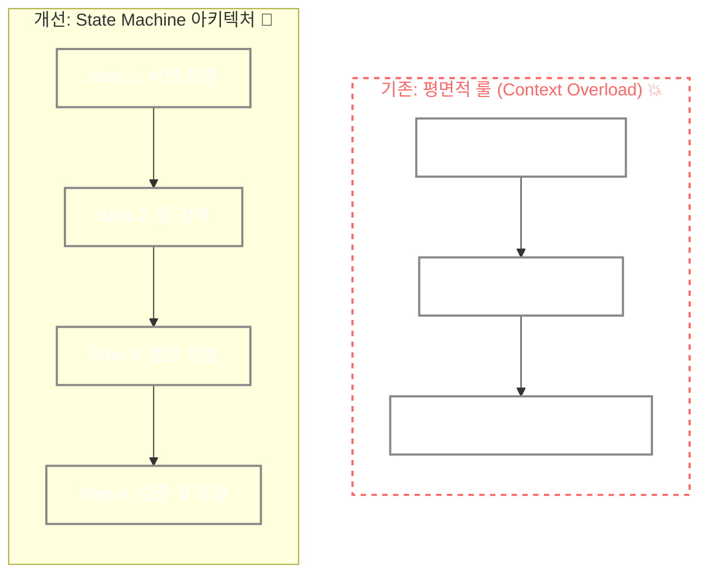

### [Real-World Anchor] AI의 환각과 컨텍스트 오버플로우
최근 AI 에이전트를 활용한 자동화 시스템에서, 프롬프트가 길어질수록 AI가 핵심 지시를 망각하거나 엉뚱한 행동을 하는 Context Window Limit(한 번에 기억하고 처리할 수 있는 문맥의 한계치) 문제가 화두가 되고 있습니다. 규칙이 너무 방대해지면 AI는 우선순위를 잃고 시스템의 안정성을 위협하는 Hallucination(AI가 사실이 아닌 내용을 마치 정답처럼 그럴싸하게 지어내는 현상) 상태에 빠지게 됩니다.

### [Context & Issue] 내 시스템의 위험 평가: 1000줄의 룰과 증발해버린 나의 경험들
개인 프로젝트에서 AI 에이전트를 제어하기 위해 `AGENTS.md` 파일에 무려 1000줄 이상의 규칙을 선언해두고 있었습니다. 하지만 이 방대한 규칙이 화근이 되었습니다. AI의 컨텍스트 한계가 초과되면서, AI가 자신이 편한 대로 룰을 무시하는 현상이 발생하기 시작했습니다.

가장 뼈아팠던 것은 **'저널 기록 누락'**이었습니다. 세션 중간중간 발생한 트러블슈팅 과정과 제 판단의 흐름을 저널 파일에 반드시 기록하도록 룰을 정해두었지만, AI가 이를 무시하면서 제 소중한 경험 데이터들이 통째로 날아가는 일들이 발생했습니다.

급기야 PowerShell 출력 과정에서 에러가 발생하며 `DevOps_FinOps_Roadmap.md` 파일의 한글 텍스트가 처참하게 깨지는 현상, 일명 Mojibake(글자가 깨져서 외계어처럼 보이는 텍스트 인코딩 오류) 장애까지 연달아 터졌습니다.

> [!WARNING]
> 파일 인코딩이 깨지면서 텍스트가 알 수 없는 문자로 변환되었습니다. 복구를 위해 Node.js의 `fs` 모듈을 활용하여 정상 상태였던 Git Blob에서 원본 내용을 UTF-8로 추출해 간신히 복구했습니다.

단순히 AI에게 텍스트를 많이 우겨넣는다고 해서 완벽하게 통제되는 것이 아님을 뼈저리게 느낀 순간이었습니다.

### [Socratic Deep Dive] 원인 파악: AI는 글이 아니라 '상태'가 필요하다

과연 규칙을 무작정 줄이는 것만이 정답일까요? 문제의 핵심은 '텍스트의 양'이 아니라 '행동의 통제'에 있었습니다.

- **나의 첫 번째 분석**: "룰이 너무 길어서 AI가 과부하에 걸렸으니, 규칙을 대폭 삭제해야겠다."
- **AI와의 문답 (Aha-Moment)**:
  - 🧠 "규칙을 삭제하면 엣지 케이스에서의 통제력도 잃지 않을까요?"
  - 🤖 "맞습니다. 텍스트 자체를 줄이는 게 아니라, 현재 어떤 단계를 밟고 있는지 State Machine(현재 상태에 따라 다음 행동이 결정되는 논리적 구조)을 명확히 줘야 합니다."
  - 🧠 "아! AI에게 1000줄을 한 번에 읽히는 게 아니라, 4단계의 뼈대(State Machine)를 세우고 각 단계마다 필요한 Trigger(특정 행동이나 규칙이 발동되는 조건 스위치)만 켜지도록 설계하면 되겠구나!"

### [Alternatives & Trade-off] 설계 및 의사결정: State Machine 도입
규칙을 삭제하는 대신, **4-Step State Machine** 뼈대를 세우고 기존 규칙의 Trigger와 Exception(일반 규칙을 벗어나는 예외 상황)을 1:1로 매핑하여 모듈화하는 방식을 선택했습니다.

1. **규칙 단순 삭제 (기각)**: 컨텍스트 과부하는 막을 수 있지만, 엣지 케이스 통제력을 상실하여 예측 불가능한 행동을 야기함.
2. **State Machine 아키텍처 도입 (채택)**: 복잡도를 낮추면서도 '행동(Behavior)'의 보존을 완벽하게 가져갈 수 있음. AI가 매 단계마다 현재 어떤 프로토콜의 몇 번째 스텝인지 인지하도록 강제함.

### [Resolution & Lesson] 검증 결과 및 통찰
룰 설계에서 중요한 것은 텍스트를 있는 그대로 보존하는 것이 아니라, AI의 **실제 행동(Behavior)**을 보존하는 것임을 깨달았습니다.

State Machine 기반으로 룰을 재설계한 후, 정적 및 동적 시뮬레이션 검증을 수행했습니다. 그 결과, AI가 컨텍스트 과부하 없이 지시된 행동을 100% 재현하는 것을 확인하고 운영 환경에 성공적으로 배포할 수 있었습니다. AI 인프라도 결국 소프트웨어 아키텍처와 동일하게 모듈화와 결합도 관리가 핵심이라는 것을 배웠습니다.
