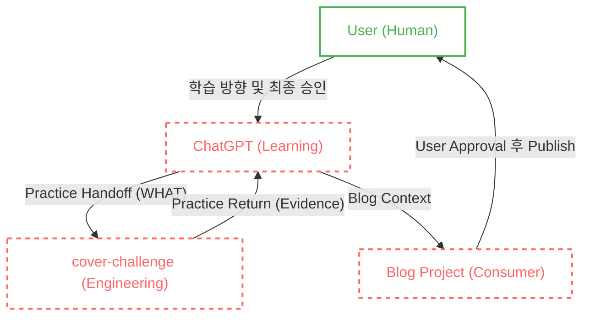

### [Real-World Anchor] AI에게 판단권을 넘기는 것의 역설
최근 인프라 실습과 문제 풀이를 위해 AI 에이전트(Antigravity)를 적극 도입하여 시스템을 구축했습니다. 초기에는 놀라울 정도로 편리했습니다. AI가 무엇을 공부할지 추천해 주고, 아키텍처를 그리고, Terraform 코드를 짜서 실행하고, 결과를 검증한 뒤 블로그 글까지 알아서 발행해 주었으니까요.

하지만 AI에게 역할이 계속 추가되며 시스템이 고도화될수록, 제 머릿속에는 서늘한 문제의식이 자리 잡기 시작했습니다.

> **"잠깐, 이러면 내가 설계를 고민하고 판단하는 게 아니라, AI가 결정하고 나는 구경만 하는 거잖아?"**

**AI를 많이 사용하는 것과 AI에게 판단권을 넘기는 것은 완전히 다릅니다.** AI가 학습 방향을 정하고, 아키텍처를 결정하며, 심지어 사용자의 이해도까지 평가해서 퍼블리싱을 통제한다면, 저는 엔지니어가 아니라 AI의 승인 봇(Bot)으로 전락할 위험이 있었습니다.

### [Context & Issue] 판단의 주체를 되찾기 위한 의사결정의 재정의
이러한 위험을 방지하기 위해, 저는 단순한 인프라 실습 랩이었던 `cover-challenge`를 **AI 시대 Infrastructure Engineer의 올바른 성장 시스템**으로 전면 재설계했습니다. 

가장 먼저 바로잡은 것은 "실제로 판단하는 주체가 누구인가?"에 대한 물음이었습니다. **최종적인 판단과 의사결정의 주체(Decision Ownership)를 오직 인간 엔지니어(User)에게 두기 위해**, 얽혀있던 거대한 파이프라인의 책임을 철저하게 분리하기 시작했습니다.

### [Deep Dive] Handoff와 Return: Learning과 Engineering의 경계
역할 분리의 핵심은 ChatGPT(Learning & Thinking)와 cover-challenge(Engineering Execution) 사이에 명확한 **경계**를 설정하는 것이었습니다. 이 둘의 상호작용은 오직 **Practice Handoff**와 **Practice Return**이라는 인터페이스를 통해서만 이루어집니다.

여기서 가장 중요한 설계 판단은 **"Handoff에서 HOW(어떻게 구현할지)를 강제하지 않는다"**는 점이었습니다. 
* Learning은 Handoff를 통해 '무엇(WHAT)을 검증할지'만 정의합니다. 만약 Handoff가 HOW까지 결정해버리면, Learning이 Engineering의 실행을 사실상 대신하게 되기 때문입니다.
* 반대로 Engineering은 실제 환경에서 '어떻게(HOW)' 구현할지 판단하고 코드를 실행한 뒤, 그 결과와 증거(Evidence)를 Practice Return을 통해 Learning으로 되돌려줍니다.

즉, Handoff와 Return은 단순한 데이터 전달 형식이 아니라, **Learning과 Engineering의 책임 경계를 엄격히 유지하기 위한 시스템적 인터페이스**입니다. 이 경계를 통해 ChatGPT가 "내가 인프라를 실행했다"고 환각(Hallucination)을 일으키거나, 반대로 Engineering Agent가 아키텍처 결정을 대신하는 문제가 발생하지 않도록 구조를 분리했습니다.

### [Alternatives & Trade-off] Blog를 철저한 하위 Consumer로 분리한 이유
마지막 구조 설계는 **Blog 시스템의 독립**이었습니다.
초기 구조에서는 프로젝트 내부에 학습, Engineering, 그리고 블로그 기록이 강하게 결합되어 있어 경계가 충분히 분리되지 않았습니다. 자칫하면 블로그 원고 자체가 시스템의 Source of Truth로 역전되어, 글을 위해 실제 인프라 상태를 왜곡하는 결과로 이어질 수 있었습니다.

따라서 다음과 같이 책임을 완전히 쪼갰습니다.
1. `cover-challenge` (Producer): 학습 맥락, 인프라 실행, 증거(Evidence), 로드맵, 포트폴리오를 관리하며 **Engineering Source of Truth**를 담당합니다.
2. `Blog Project` (Consumer): 오직 글의 작성, 편집, 리뷰, 퍼블리싱만 담당합니다.

결과적으로 Blog는 Engineering 사실이나 Architecture를 결정하는 주체가 아닙니다. 이미 완성된 Learning과 Engineering의 결과를 `Blog Context`라는 인터페이스로 전달받아 외부 독자에게 전달하는 **Downstream Artifact (하위 산출물)**로 역할을 한정시켰습니다.

### [Resolution & Lesson] 
이 재설계를 통해 인프라 설계, 실행, 외부 기록이라는 3개의 파이프라인이 명확한 책임 경계를 갖게 되었습니다. 

물론 이 구조가 완벽한 종착지이거나, 실제 운영에서의 모든 잠재적 문제가 해결된 것은 아닙니다. 현재는 구조적 설계를 완료하고 실제 사용을 막 시작하는 단계입니다. 하지만 이 시스템을 통해 가장 중요한 철학 하나는 확고히 다졌습니다. 

**"AI를 적극적으로 활용하되, 최종적인 판단과 의사결정의 주체는 영원히 인간 엔지니어에게 남겨둔다."**

앞으로 이 명확한 경계 위에서 실제 인프라 실습과 트러블슈팅을 전개하며, 이 거버넌스가 어떻게 동작하는지 계속 검증해 나갈 예정입니다.
