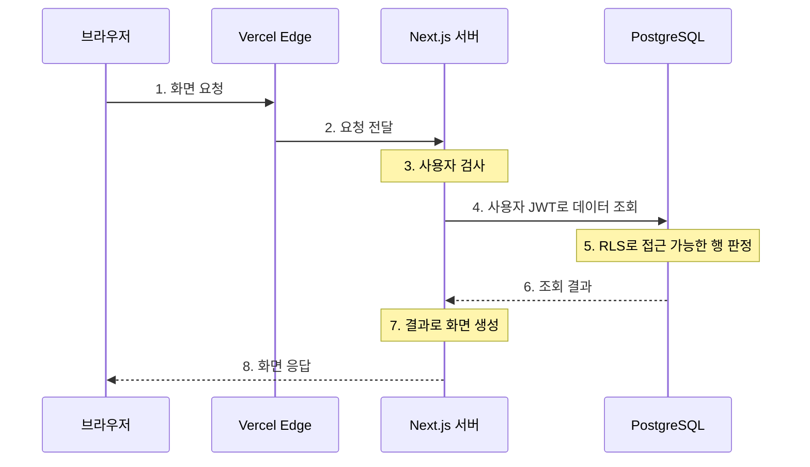

## 친구의 ERP 아키텍처를 읽어보게 됐다

친구가 ERP 아키텍처를 정리한 PDF를 보내줬다. 문서의 기준일은 2026년 9월 23일이었다. Claude가 구성에 관여했다고 들었지만, 개별 설계 결정을 누가 내렸는지까지는 알 수 없었다.

이 구조를 이해하기 위해 내가 익숙한 AWS와 Spring 개념을 출발점으로 삼았다. Vercel Edge는 AWS에서 어떤 역할에 가까운지, Next.js는 화면만 만드는지, Supabase Auth와 RLS는 각각 무엇을 하는지 연결해 보는 방식이었다.

나처럼 AWS·Spring 쪽이 더 익숙하다면, 먼저 세 가지를 생각하면서 읽으면 좋겠다. 요청을 받아 화면을 만드는 서버, 사용자가 누구인지 확인하는 인증, 사용자에게 보여줄 데이터를 제한하는 접근 통제다. 이 역할들이 어디에 놓이는지부터 따라가 봤다.

궁금했던 것은 이 설계가 운영에 적합한가보다는, **어디에서 화면을 만들고, 누구인지 확인하고, 어떤 데이터를 허용하는가**였다. AI의 설명과 예시를 참고하면서 이 세 가지를 구분해 봤다.

이 글은 그 과정에서 정리한 이해를 옮긴 기록이다. 원고를 정리하면서 PDF 원문을 다시 대조하지는 않았고, 프로젝트 코드나 실제 배포 환경도 확인하지 않았다. 문서에 적힌 구현·테스트·운영 내용은 작성자의 설명으로 받아들였다.

## Vercel Edge는 S3에 가까울까?

처음에는 Vercel Edge를 S3에 연결했다. 정적 파일을 사용자에게 제공한다는 점을 생각했기 때문이다. 그런데 이 비유에는 저장과 전달이라는 두 역할이 섞여 있었다.

파일의 원본을 어디에 보관하는지와, 요청한 사용자에게 어디에서 전달하는지는 다른 문제다. S3에 보관한 파일을 CloudFront를 통해 전달하는 구조를 떠올리면 이 차이가 보인다.

AWS에서 S3는 객체를 저장하고, CloudFront는 콘텐츠를 엣지에서 사용자에게 전달한다. 이 둘을 나누고 보니, Vercel Edge의 정적 자산 전달 역할은 S3보다 CloudFront에 가깝게 이해할 수 있었다. [Amazon S3 공식 문서](https://docs.aws.amazon.com/AmazonS3/latest/userguide/Welcome.html), [Amazon CloudFront 공식 문서](https://docs.aws.amazon.com/AmazonCloudFront/latest/DeveloperGuide/Introduction.html)

물론 Vercel 전체를 CloudFront와 같다고 볼 수는 없다. Vercel의 CDN은 캐시뿐 아니라 요청 라우팅 등도 맡는다. 여기서 내가 연결한 것은 정적 자산을 전달하는 역할이다. Next.js의 서버 코드가 모두 엣지에서 실행된다는 의미도 아니다. [Vercel CDN 공식 문서](https://vercel.com/docs/cdn)

처음 비유를 고치고 나니 다른 구성요소도 같은 방식으로 볼 수 있었다. 제품 이름 하나에 익숙한 서비스 하나를 붙이기보다, 어떤 역할을 비교하고 있는지 먼저 구분해야 했다.

## Next.js 안에도 서버가 맡는 일이 있었다

Next.js는 처음에 화면을 만드는 기술로 봤다. 하지만 이 구조를 읽으면서 DB 조회와 입력 처리도 함께 맡는 것으로 이해했다.

Spring을 기준으로 생각하면 사용자 요청을 받고, 필요한 데이터를 조회하고, 처리 결과를 응답하는 서버의 책임이 익숙하다. 그 책임을 Next.js에서 찾아보니, 화면 생성 앞뒤에 있는 처리도 함께 볼 수 있었다.

Next.js는 일반적으로 서버에서 데이터를 조회하고 화면 일부를 렌더링할 수 있으며, 서버 요청을 처리하는 기능도 제공한다. 그렇다고 Spring의 계층 구조나 실행 방식까지 그대로 대응되는 것은 아니다. [Next.js Server and Client Components](https://nextjs.org/docs/app/getting-started/server-and-client-components), [Next.js Backend for Frontend](https://nextjs.org/docs/app/guides/backend-for-frontend)

이번에 이해한 흐름에서는 Next.js가 사용자를 검사하고, 사용자 맥락으로 데이터를 조회한 뒤, 결과를 화면에 연결하는 위치에 있었다. 화면을 만드는 기술이라는 첫 이해에 서버 처리라는 역할을 더한 셈이다.

## 로그인했다는 것과 데이터를 볼 수 있다는 것

Supabase Auth와 PostgreSQL RLS를 볼 때는 사용자 확인과 데이터 접근 허용을 나누는 것이 중요했다. RLS는 Row Level Security의 약자로, DB 테이블의 행마다 접근을 제한하는 기능이다. 테이블 전체에 접근할 수 있는지만 보는 데서 더 나아가, 그 안의 어떤 행을 볼 수 있는지까지 나누는 것이다.

Auth는 사용자가 누구인지 확인하는 인증에 연결했다. RLS는 그 사용자가 어떤 행에 접근할 수 있는지 결정하는 인가에 연결했다. 로그인한 사용자라고 해서 모든 데이터를 볼 수 있는 것은 아니므로, 두 책임을 따로 생각해야 했다.

여기서 JWT는 사용자 정보를 담아 전달하는 서명된 토큰이다. Supabase에서는 이 토큰의 정보를 RLS 정책에서 활용할 수 있다. 사용자 맥락이 DB 조회에 전달되고, RLS 정책이 그 맥락을 바탕으로 행 접근을 판정하는 식으로 이해했다. [Supabase JWT 공식 문서](https://supabase.com/docs/guides/auth/jwts), [Supabase RLS 공식 문서](https://supabase.com/docs/guides/database/postgres/row-level-security)

예를 들어 가상의 ERP에서 로그인한 사용자에게 자신이 담당하는 업무의 행만 보여준다고 생각해 봤다. 사용자가 누구인지 확인하는 일과, 그 행이 사용자의 담당 업무인지 판정하는 일은 구분된다. 이 예시는 역할을 이해하기 위한 것으로, 친구 프로젝트의 실제 테이블이나 정책을 옮긴 것은 아니다.

여기까지는 책임을 나누어 이해한 내용이다. 실제 JWT 검증 방식이나 RLS 정책을 확인한 것은 아니어서, 이 구성이 있다는 사실만으로 접근 통제가 올바르게 동작한다고 판단하지는 않았다.

## 화면 요청 하나를 따라가 봤다

각 역할을 따로 본 다음에는 사용자별 화면 요청 하나를 기준으로 연결해 봤다.

아래는 내가 이해한 흐름을 일반화해 그린 도식이다. 원문 PDF의 도식을 복제한 것이 아니며, 요청 추적이나 실행 로그로 확인한 경로도 아니다.

왼쪽에서 오른쪽으로는 요청이 이동하고, 위에서 아래로는 처리 순서가 이어진다. 실선은 요청과 처리, 점선은 돌아오는 결과를 나타낸다.

브라우저는 화면을 요청하고, Vercel Edge는 요청을 전달한다. Next.js는 사용자 검사와 화면 생성을 맡고, PostgreSQL에서는 RLS가 행 접근을 판정한다. 화면 응답의 점선은 브라우저로 결과가 돌아온다는 뜻이며, 중간 전달 경로는 생략했다.

먼저 브라우저의 요청이 Vercel Edge로 들어오고, Next.js의 사용자 검사로 이어진다고 정리했다. 그다음에는 사용자 JWT를 사용하는 DB 조회를 생각했다. 화면을 요청한 사용자의 맥락이 데이터 조회에도 연결되는 부분이다.

DB에서는 RLS 정책이 접근할 수 있는 행을 판정하고, Next.js는 조회 결과를 이용해 화면 응답을 만든다고 이해했다. 이렇게 연결하니 사용자 확인과 데이터 접근 판정이 화면 생성 과정의 어디에 놓이는지 볼 수 있었다.

이 흐름에서 확인하려던 질문은 다음과 같았다.

1. 요청은 어디로 들어오는가?
2. 서버는 사용자를 어떻게 검사하는가?
3. DB 요청에는 어떤 사용자 맥락이 전달되는가?
4. 어떤 행에 접근할 수 있는지는 어디에서 판정하는가?
5. 조회 결과는 어떻게 화면 응답으로 이어지는가?

다만 도식의 화살표는 역할 간의 논리적인 연결이다. 중간 API 계층이나 실제 DB 연결 방식까지 나타내지는 않았다. 사용자별 화면 조회에 초점을 맞췄으므로 입력 처리나 모든 요청이 같은 경로를 따른다는 의미도 아니다.

## 캐시도 무엇을 캐시하는지 나눠야 했다

캐시를 볼 때도 처음에는 하나의 처리로 생각했다. 이후에는 공통 정적 자산의 캐시와 사용자별 ERP 화면의 비캐시 처리를 구분했다.

공통으로 사용하는 자산과 사용자의 데이터가 포함된 화면은 응답을 재사용할 수 있는 범위가 다르다. 그래서 캐시를 사용한다는 설명만 읽기보다, 무엇을 대상으로 하는지 함께 봐야 했다.

예를 들어 모두가 사용하는 같은 버전의 CSS 파일과, 각 사용자의 담당 업무가 담긴 화면을 생각해 볼 수 있다. CSS 파일은 여러 사용자에게 같은 내용으로 전달할 수 있지만, 업무 화면은 요청한 사용자에 따라 내용이 달라진다. 이 차이가 공통 자산과 사용자별 응답을 나누어 생각한 이유다. 여기서도 예시는 설명을 위한 것이며 실제 프로젝트의 파일이나 데이터는 아니다.

Vercel은 정적 자산뿐 아니라 페이지와 API 응답도 캐시할 수 있다. 따라서 사용자별 화면이라는 이유만으로 자동으로 캐시되지 않는다고 볼 수는 없다. 실제 처리는 응답 설정과 사용한 기능을 확인해야 한다. [Vercel CDN Cache 공식 문서](https://vercel.com/docs/caching/cdn-cache)

내가 여기서 정리한 것은 캐시 대상을 나누는 관점이다. 프로젝트의 응답 헤더나 캐시 적중 여부를 확인한 것은 아니므로, 실제 비캐시 동작을 검증한 결과는 아니다.

## Storage와 pg_cron은 어떻게 읽었나

Supabase Storage는 파일을 저장하는 역할로 이해했다. 공식 문서에서는 파일 저장과 제공 기능을 설명하지만, 이번에 내가 연결한 중심 역할은 저장이었다. 앞에서 Vercel Edge를 보며 나눈 저장과 전달의 구분을 여기에도 적용했다. [Supabase Storage 공식 문서](https://supabase.com/docs/guides/storage)

pg_cron은 DB 내부에서 예약된 작업을 실행하는 역할로 이해했다. Supabase Cron도 내부적으로 PostgreSQL 확장인 pg_cron을 예약과 실행 엔진으로 사용한다고 설명한다. [Supabase Cron 공식 문서](https://supabase.com/docs/guides/cron)

백업, DB 변경, 수동 테스트, 리전, 엑셀 처리 한계도 함께 살펴봤다. 다만 이 글에서는 역할과 요청 흐름에 집중하고, 구체적인 설정이나 결과를 정리하지 않은 주제들은 더 확장하지 않았다.

## 익숙한 이름보다 역할을 먼저 보기

처음과 비교하면 내가 구조를 읽는 기준이 달라졌다. Vercel Edge를 S3에 연결하는 것에서 시작했지만, 이후에는 저장과 전달을 나누고, 화면 생성과 서버 처리를 함께 보고, 인증과 인가를 구분했다.

지금까지 이해한 역할을 정리하면 다음과 같다.

| 역할 | 연결해서 이해한 구성요소 |
| --- | --- |
| 정적 자산 전달 | Vercel Edge — CloudFront의 전달 역할에 연결 |
| 화면 생성과 서버 처리 | Next.js — Spring에서 익숙한 서버 처리 책임에 연결 |
| 신원 확인 | Supabase Auth |
| 행별 데이터 접근 판정 | PostgreSQL RLS |
| 파일 저장 | Supabase Storage |
| DB 내부 예약 실행 | pg_cron |

이렇게 역할을 나누니 제품 이름을 대응시킬 때보다 요청과 데이터의 흐름을 연결하기 쉬웠다. AWS·Spring에서 익숙한 개념은 이해의 출발점이 되었고, 비유가 어디까지 적용되는지 구분하는 과정도 함께 필요했다.

이 과정에는 AI의 설명과 예시가 도움이 되었다. 내가 직접 ERP를 구축하거나 동작을 검증한 기록은 아니다. 문서와 실제 구현이 일치하는지, JWT·RLS·캐시가 어떻게 설정되어 있는지, 성능과 백업의 복구 가능성은 아직 확인하지 못했다.

친구 프로젝트의 식별 정보나 원문 도식·문구는 옮기지 않고, 이해한 구조를 일반화해 정리했다. 이번에 남기고 싶은 것은 낯선 아키텍처를 읽을 때 제품 이름뿐 아니라 각 구성요소가 맡은 역할과 그 사이의 흐름을 함께 보는 방법이다.
